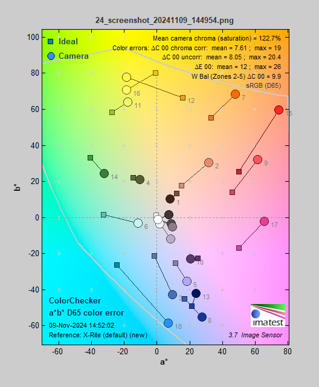

# FPGA-ISP

# **第一部分** **设计概述**

## 1.1 设计目的

本项目旨在设计并实现一款基于FPGA的高性能实时图像信号处理（ISP）系统，利用TangMega138K Pro平台的强大算力，为自动驾驶等应用领域提供卓越的图像处理能力。系统通过DVP接口接收来自摄像头的RAW图像数据，集成多种ISP功能模块，并结合AI算法优化低光环境下的图像质量，提升夜间和低光条件下的图像细节与光照表现，增强自动驾驶系统的感知能力和安全性。此外，系统支持 USB2.0 UVC 模拟设备实现即插即用，满足自动驾驶领域的需求。

## 1.2 应用领域

该系统主要应用于自动驾驶领域，尤其适用于复杂光照环境（如隧道、夜晚行驶）下的实时图像处理。除自动驾驶外，系统还可应用于视频监控和智能机器人等对实时性和稳定性要求较高，抑或是工作环境光照条件恶劣的领域。

## 1.3 主要技术特点

系统设计涵盖ISP系统、UVC模块和AI夜景处理模块，分别负责图像处理、数据传输与增强，低光处理。**完全自研**的ISP系统及其子模块，涵盖CFA，AWB，CCM，GAMMA等多种功能，具有**结构精炼，资源占用少，系统频率高**等一系列优点。UVC模块实现USB**即插即用**的视频传输，便于与外部设备连接。AI夜景处理模块采用深度学习模型（Zero-DCE）提升低光环境下的图像效果，确保自动驾驶系统在复杂条件下的视觉感知能力，提升夜间和低光条件下的图像细节与光照表现，增强自动驾驶系统的感知能力和安全性。

## 1.4 关键性能指标

- **系统工作频率**：74.25MHz，系统工作频率高，计算性能强。
- **清晰度与帧率**：1024*1024@70fps
- **平均彩度为122.7%**：达到色彩鲜艳且不失真实的效果。
- **信噪比（SNR）**：亮度通道（Y）为**32.4 dB**，绿色通道为**31.9 dB**，确保了低噪声和丰富的细节表现。
- **灰阶响应**：中等灰度区域的灰度准确，高亮度和低灰度区域灰度略偏低但**符合标准**。
- **Gamma值为0.595**：表明摄像头具备良好的亮度信号平衡性。
- **噪声特性**：低频噪声较高，但随频率增加显著下降，**噪声控制表现稳定**，整体画面纯净度高。

## 1.5 主要创新点

(1) 在FPGA平台上部署深度学习模型提升夜间和低光条件下摄像头性能。
(2) 集成UVC模块实现USB视频传输，提升易用性和兼容性。
(3) 系统在复杂光照条件下提供清晰、稳定的图像输出，适应多种应用场景。

# **第二部分**  **系统组成及功能说明**

## 2.1 整体介绍

##### 总系统框图


##### 系统介绍

  本系统总共由摄像头控制器，ISP系统，DDR控制器，HDMI传输四大部分组成。其中摄像头控制器，DDR控制器，HDMI传输部分的设计由**武汉芯路恒科技有限公司小梅哥ACG525例程**移植而来，ISP系统由本团队**完全自研**。系统工作中所需的稳定时钟由gowin的 `PLL IP`核提供。系统启动时，`camera_init`通过其 `i2c`组件初始化 `ov5640`摄像头寄存器，配置摄像头工作模式。系统稳定运行后，通过 `DVP_Capture`模块接收摄像头通过DVP端口输出的RAW图像数据，并整理同步信号。之后数据流入ISP系统，依次经过 `CFA`，`AWB`，`CCM`，`GAMMA`等模块处理后输出。同时该部分配置了一个按键用于实现isp输出显示模式的切换，支持RAW源图像、CFA处理后图像、AWB处理后图像、CCM处理后图像、GAMMA处理后图像五种模式。受限于开发时间限制，现阶段仅完成了的AI模块的仿真模拟，后续会将AI低光处理模块整合至ISP系统中。ISP系统输出的数据通过 `wr_data_fifo`写入DDR中，HDMI及UVC通过 `rd_data_fifo`从DDR中读出数据，以解决读写不同频的问题。HDMI部分将读出的数据通过TMDS编码后输出到DVI接口中，实现在显示器上的显示。UVC模块将读出的数据通过USB总线与上位机相连，该模块已完成仿真开发，后续将整合至系统中。同时，RISC-V同样可以控制系统内参的调整。

##### 资源消耗  
基于Tang Mega 138k pro Dock开发

| Reg  | LUT  | ALU  | BSRAM | SSRAM | MULT |
| ---- | ---- | ---- | ----- | ----- | ---- |
| 8316 | 6241 | 1262 | 46    | 130   | 3    |


## 2.2 各模块介绍

这部分包含各个模块的系统框图，设计简介，算法简介，实现细节，端口及参数说明，时序说明。

### 2.2.0 RISC-V控制器

RISC-V控制器包含可被外部读写的内部寄存器和一条指令总线，通过修改寄存器可以控制系统内参的调整，同时，每次修改寄存器后，通过控制总线来控制相应模块的刷新，避免频繁刷新带来的资源消耗。

RISC-V控制器基于e203项目改造而来，使我们的系统拥有更强的泛用性。哪怕是初学者也可以通过一段简单的C代码来实现针对摄像头内参的自由调整。

C代码示例：

```c++
#include <stdint.h>
#include <unistd.h>
#include <stdio.h>
#include <platform.h>
#include "init.h"

#define STRBUF_SIZE			256	// String bufferS size

#define ISP_BUS_EN  0x0000000F;


#define ISP_CTRL_ADDR     _AC(0x10014000,UL)  
#define ISP_STATE_REG(offset) _REG32(ISP_CTRL_ADDR, offset)

//状态寄存器
#define ISP_CFA_STATE_REG     	0x00
#define ISP_AWB_STATE_REG     	0x04
#define ISP_CCM_STATE_REG     	0x08
#define ISP_GAMMA_STATE_REG     0x0C
#define ISP_AI_STATE_REG     	0x10

int get(){
	char str=12;
	for(int i=1;i<=20;i++){
		scanf("%c", &str);
	}
	return (int)str+80;
}

int main(void)
{
	_init();
	

	GPIO_REG(GPIO_OUTPUT_EN)|=ISP_BUS_EN;
	GPIO_REG(GPIO_OUTPUT_VAL)=0x00000001;
	while(1)
	{	
		
		// scanf("%c", &str);
		// printf("str_addr:%x\n",(int)(&str));
		int a=get();
		// printf("Hi computer:I have received:%d\n",a);
		if(a==1){//CFA type 
			int rb=ISP_STATE_REG(ISP_CFA_STATE_REG);
			int b=get();
			ISP_STATE_REG(ISP_CFA_STATE_REG)= b;
			GPIO_REG(GPIO_OUTPUT_EN)|=ISP_BUS_EN;
			GPIO_REG(GPIO_OUTPUT_VAL)=0x00000001;
			printf("Have Changed CFA type from %d to %d!",rb,b);
		}
		if(a==2){//GAMMA type
			int rb=ISP_STATE_REG(ISP_GAMMA_STATE_REG);
			int b=get();
			ISP_STATE_REG(ISP_GAMMA_STATE_REG)= b;
			GPIO_REG(GPIO_OUTPUT_EN)|=ISP_BUS_EN;
			GPIO_REG(GPIO_OUTPUT_VAL)=0x00000002;
			printf("Have Changed GAMMA type from %d to %d!",rb,b);
		}
		//Waiting for your coding 
	}
	return 0;
}

```

### 2.2.1 ov5640的控制与输出模块

  ov5640摄像头的控制通过SCCB接口（类似于I2C协议），实现对OV5640的寄存器写操作，进一步实现对ov5640的配置。配置完成后，通过dvp_capture模块实现对摄像头dvp接口输出数据的捕获与整理，使其符合后续系统的要求。同时摄像头的稳定工作依赖一个稳定是时钟信号，这里使用gowin的PLL IP核来实现。

  本部分移植自**武汉芯路恒科技有限公司小梅哥ACG525例程**。


##### 资源消耗  
基于Tang Mega 138k pro Dock开发

| Reg  | LUT  | ALU  | BSRAM | SSRAM | MULT |
| ---- | ---- | ---- | ----- | ----- | ---- |
| 101 | 259 | 0 | 1 | 0 | 0 |

#### 2.2.1.1 I2C通讯模块

  I2C接口控制器子模块用于实现I2C总线通信协议，是一种串行通信接口，广泛应用于嵌入式系统中。该模块的主要功能是支持FPGA与外部I2C器件（如EEPROM、传感器等）的数据交互，通过串行时钟线（SCL）和数据线（SDA）进行半双工通信。I2C协议基于主从架构，模块作为主设备，通过控制SDA和SCL的状态实现数据传输，并管理起始信号、应答信号、停止信号等。

  本项目中该模块主要用于对ov5640的寄存器进行读写以完成对其的配置。

##### 设计简介

  模块设计基于I2C协议，整体架构可分为时序控制模块、数据传输模块和状态机控制模块。时序控制通过50MHz的时钟信号和分频电路来生成符合I2C协议要求的SCL频率。模块设计核心是一个状态机，通过空闲态、写入器件地址、发送数据、读取数据等状态的切换，控制数据在FPGA和I2C从设备之间的双向传输。

  设计采用了状态机模式，将整个I2C的读写操作分解为小的状态单元，包含发起始信号、写地址、写数据、读数据、应答检测、停止信号等状态。I2C协议读写传输的复杂性通过状态划分得以简化，每个小状态负责一个特定操作，提升代码的可读性与可维护性。

##### 实现细节

模块的I2C传输通过生成SCL和SDA信号，配合I2C总线开漏结构实现。控制逻辑通过以下主要步骤完成I2C数据传输：

- 发起始信号：在SCL高电平时，将SDA由高拉低，表示通信开始。
- 器件地址写入：发送器件地址和方向位（0为写，1为读），等待从设备应答信号。
- 数据写入与读取：在8位数据传输中，SDA发送或接收数据位，同时SCL进行高低电平转换，每个数据位均需在SCL高电平时保持稳定。
- 停止信号：在SCL高电平时，将SDA由低拉高表示传输结束。

  以寄存器访问为例，模块内部设计了`write_byte`和 `read_byte`任务，通过控制 `Cmd`命令端口的状态切换和 `Go`信号的启动，实现地址字节和数据字节的顺序传输。此外，通过 `Trans_Done`信号判断传输完成，确保状态机能够及时进入下一状态。

##### 端口及参数说明

###### 端口说明

| 信号    | 方向 | 位宽 | 描述           |
| :-------- | ---- | ---- | ---------------------- |
| clk     | I  | 1  | 输入时钟信号       |
| reset_n   | I  | 1  | 复位信号（低电平有效） |
| wrreg_req | I  | 1  | 写请求信号       |
| rdreg_req | I  | 1  | 读请求信号       |
| addr    | I  | 16   | 目标寄存器地址     |
| wrdata  | I  | 8  | 写入数据字节       |
| rddata  | O  | 8  | 读取数据字节       |
| RW_Done   | O  | 1  | 读/写完成信号      |

##### 时序说明

时序上，I2C接口控制器的工作频率为400kHz，满足I2C协议的快速模式。分频电路基于50MHz的系统时钟，通过设置分频参数控制SCL的频率。在波形仿真中，模块生成的SCL和SDA信号严格遵循I2C总线时序要求，能够在正确的时钟上升沿或下降沿实现信号转换，确保数据的准确传输。

- 写操作：发起始信号后依次发送设备地址、寄存器地址和数据，波形仿真显示数据传输稳定，满足I2C协议的时序要求。
- 读操作：发起始信号并写入器件地址后，成功接收从设备发送的数据，并在主设备给出无应答信号后停止传输。

##### 资源消耗  
基于Tang Mega 138k pro Dock开发

| Reg  | LUT  | ALU  | BSRAM | SSRAM | MULT |
| ---- | ---- | ---- | ----- | ----- | ---- |
| 67   | 186  | 0    | 0     | 0     | 0    |


#### 2.2.1.2 ov5640初始化模块

  OV5640初始化模块的主要功能是通过FPGA配置OV5640摄像头的寄存器，从而实现摄像头的上电初始化和工作模式的设置，使得其能够提供符合系统需求的图像输出。通过SCCB接口（类似于I2C协议），初始化模块实现对OV5640的寄存器写操作，配置如图像格式、分辨率、帧率等参数。该模块在系统中起到启动和配置摄像头的关键作用，确保图像采集模块能正常接收数据流。

##### 系统框图


##### 设计简介

OV5640初始化模块的架构包括以下几个子模块：

- SCCB通信控制器：管理SCCB通信协议，确保寄存器配置的正确时序。
- 寄存器配置序列管理：根据摄像头的使用需求（如图像格式和帧率），对所需的寄存器进行初始化配置。
- 状态机控制：通过有限状态机（FSM）实现各个初始化阶段的管理，FSM负责依次配置寄存器，并在遇到错误时跳转至错误状态，保证配置过程的可靠性。

##### 实现细节

在OV5640初始化模块的实现细节中，模块通过逐步配置多个关键寄存器，确保摄像头在RAW模式下的正常工作。该模块使用SCCB接口将初始化配置表中每一个寄存器逐一写入摄像头，这一过程包括复杂的寄存器设置和多个重要的工作步骤。以下是详细的实现细节：

1. 复位和初始化：

- 全局复位（寄存器0x3008）：首先，模块将 `0x3008[7]`设置为高电平以重置摄像头，确保寄存器回到默认状态。这是一个必不可少的操作，防止摄像头在上电后出现状态不一致的情况。
- SCCB复位（寄存器0x3103）：在复位之后，SCCB模块通过 `0x3103`配置其工作模式，确保摄像头能够通过SCCB通信进行寄存器配置。

2. 系统时钟配置：

- PLL配置（寄存器 `0x3034`、`0x3035`、`0x3036`、`0x3037`、`0x3824`）：模块首先配置PLL的倍频和分频参数，以生成摄像头内部所需的时钟频率。具体来说，`0x3036`设置为0x63，倍频系数为99，使得内部时钟频率达到1188MHz，再经过分频步骤得到最终的输出频率。
- 详细分析：输入24MHz时钟经PLL预分频（`0x3037`的低四位设为2），先降频到12MHz。随后 `0x3036`的倍频设置将时钟提高至1188MHz，再经系统分频器分为594MHz。之后由PCLK分频（`0x3108`的 `bit[5:4]`设为 `00`不分频）分为297MHz。随后P divider分频（`0x3035`的 `bit[3:0]`设为 `1`，在DVP模式下分频系数为 `2*0x3035[3:0]`）分为148.5MHz。最后Scale divider分频（`0x3824[4:0]`设为2故需要进行2分频）分为74.25MHz。
- 时钟分频控制（寄存器0x3108）：PCLK的分频控制用于进一步调节输出时钟频率。例如，设置 `0x3108`为 `00`表示不分频，这使得最终输出时钟频率为74.25MHz。

3. 图像输出格式设置：

- 格式选择（寄存器0x4300）：模块通过将 `0x4300`的低三位设为 `011`以选择RAW格式，适配本模块的RAW模式采集要求。该寄存器控制输出格式的基本类型，在RAW模式下，摄像头直接输出未经处理的原始数据，有利于后续图像处理和增强。
- 格式MUX控制（寄存器0x501F）：设置 `0x501F`的低三位为 `011`，选择ISP RAW输出模式，并启用缺陷像素校正功能。此配置直接影响图像数据的质量和一致性。

4. 分辨率和尺寸设置：

- DVP输出分辨率（寄存器0x3808-0x380B）：配置输出图像的水平和垂直分辨率。在该模块中，设置水平分辨率为640、垂直分辨率为480。这些寄存器将图像输出宽度与高度分别写入，以满足DVP接口的输出需求。
- 水平采样起始与终止（寄存器0x3800-0x3801）：通过设定水平起始和结束地址，控制图像采样窗口的X方向范围。这一步控制了图像的采样宽度，确保传感器能够采集完整的图像信息。
- 垂直采样起始与终止（寄存器0x3802-0x3803）：类似地，配置Y方向的采样范围以完成图像窗口的垂直定义。
- 总体水平和垂直尺寸（寄存器0x380C-0x380F）：设置整体图像的行宽和列高，影响了DVP的传输时序，并确保图像的完整性和分辨率。

5. 镜像和翻转设置：

- 垂直翻转（寄存器0x3820）：通过动态配置参数 `IMAGE_FLIP_EN`，控制是否启用图像的垂直翻转。翻转设置由 `0x3820`的 `bit[2:1]`位来控制，确保图像在特定应用场合下能够符合用户预期的方向。
- 水平镜像（寄存器0x3821）：同样可根据参数 `IMAGE_MIRROR_EN`启用水平镜像。将 `0x3821`的 `bit[1:0]`设为相应值，配置摄像头镜像效果。这种镜像和翻转的灵活性确保图像可以适应多种设备和显示需求。

6. 自动曝光控制（AEC）：

- 最大曝光限制（寄存器0x3A02-0x3A15）：模块通过多个AEC寄存器配置50Hz和60Hz环境下的最大曝光时间，以适应不同光源的频率。特别是 `0x3A02`和 `0x3A03`定义60Hz频率下的曝光上限，确保在环境光强变化时自动调整曝光。
- 频带宽度（寄存器0x3A08-0x3A0E）：此部分设置50Hz和60Hz的带宽与最大频段数，以优化图像的清晰度和明暗区域表现。

7. 黑电平校准（BLC）：

- 黑电平起始行和行数（寄存器0x4001、0x4004）：配置BLC的起始行和校准行数，在低光环境下确保黑色背景的均匀性。`0x4001`指定BLC的起始行，`0x4004`设置行数，以优化暗部区域的细节表现，减小图像噪声。

##### 端口及参数说明

###### 端口说明

| 信号     | 方向 | 位宽 | 描述             |
| :----------- | ---- | ---- | ---------------------------- |
| Clk      | I  | 1  | 输入时钟信号         |
| Rst_n    | I  | 1  | 复位信号（低电平有效）     |
| Init_Done  | O  | 1  | 摄像头配置完成信号       |
| camera_rst_n | O  | 1  | 摄像头复位信号（低电平有效） |
| camera_pwdn  | O  | 1  | 低功耗模式控制信号       |
| i2c_sclk   | I/O  | 1  | i2c时钟线          |
| i2c_sdat   | I/O  | 1  | i2c数据线          |

###### 参数说明

| 参数      | 描述       | 默认值   | 取值范围              |
| --------------- | ---------------- | ---------- | --------------------------------- |
| SYS_CLOCK     | 系统时钟频率   | 50M    | -                 |
| SCL_CLOCK     | SCL总线频率    | 1024     | <=1024（>1024未做测试）       |
| CAMERA_TYPE   | 摄像头型号     | “ov5640” | “ov5640”<br />“ov7725”    |
| IMAGE_TYPE    | 输出图像格式   | 0      | 0:RGB`<br>`1:JPEG `<br>`2:RAW |
| IMAGE_WIDTH   | 输入图像的宽度   | 640    | <=1024（>1024未做测试）       |
| IMAGE_HEIGHT  | 输入图像的高度   | 480    | <=1024（>1024未做测试）       |
| IMAGE_FLIP_EN   | 输入图像是否翻转 | 0      | 0/1                 |
| IMAGE_MIRROR_EN | 输入图像是否镜像 | 0      | 0/1                 |

##### 资源消耗  
基于Tang Mega 138k pro Dock开发

| Reg  | LUT  | ALU  | BSRAM | SSRAM | MULT |
| ---- | ---- | ---- | ----- | ----- | ---- |
| 34   | 73   | 0    | 1     | 0     | 0    |

#### 2.2.1.3 DVP 接口模块

DVP_Capture_raw子模块实现了对DVP（Digital Video Port）接口数据流的接收与处理，具体负责从摄像头模块中接收像素数据并将其转换为标准格式供后续处理。该模块在整个系统中用于接收并存储视频数据流，将像素数据从8位并行的输入形式转换为16位raw格式输出。该模块的核心任务包括：

- 同步信号处理和图像数据的有效性检测；
- 丢弃初始化阶段的多余图像帧，确保数据的稳定性。

##### 系统框图


##### 设计简介

模块架构采用时序逻辑设计，主要分为以下几个部分：

- 同步信号管理：通过捕获Vsync和Href信号上升沿与下降沿来控制图像的帧和行边界，确保数据采集准确。
- 数据有效性检测与丢帧控制：模块启动时，通过 `FrameCnt`计数器丢弃前10帧图像数据，避免初始化时不稳定的图像。启用数据时，`dump_frame`标志指示有效数据帧的到来。
- 数据拼接：由于DVP接口每次只传输8位数据，模块通过时钟边沿检测机制，将相邻的两个8位数据拼接为16位RGB565像素数据。
- FIFO与位置控制：为了支持后续的数据处理，模块实时输出像素位置(`Xaddr`和 `Yaddr`)用于定位操作。

该设计采用状态机（FSM）控制寄存器配置的顺序和时间，确保数据采集的时序准确。

##### 实现细节

`DVP_Capture_raw`模块的具体实现过程包括以下详细步骤：

1. 数据同步：

- 使用寄存器对Vsync、Href和Data信号打拍，确保这些信号在PCLK上稳定并去除毛刺。此过程将 `Vsync`和 `Href`信号保存至 `r_Vsync`和 `r_Href`寄存器，同时将Data缓存至 `r_Data`寄存器，便于后续数据处理。

2. 数据拼接与有效性：

- 像素数据拼接：在 `PCLK`上升沿，模块检测 `Href`高电平期间的数据，将奇数和偶数时钟周期的数据分别作为16位RGB565像素的高字节和低字节。拼接的结果保存至 `r_DataPixel`寄存器，并输出到 `DataPixel`端口。
- 数据有效信号：`r_DataValid`寄存器在 `Href`为高电平期间拉高，指示数据有效。与 `dump_frame`结合后输出到 `DataValid`信号，确保丢弃不稳定的帧数据。

3. 同步信号输出：

- `DataHs`和 `DataVs`信号分别基于 `r_Href`和 `~r_Vsync`生成，指示行同步和帧同步信号。行同步信号在每行数据传输时有效，帧同步信号标记每帧图像的开始，保持DVP接口的时序一致性。

4. 图像状态与帧丢弃：

- 帧计数器：模块使用 `FrameCnt`寄存器计数VSYNC信号上升沿，初始时丢弃前10帧数据，以确保图像采集在稳定状态下进行。当 `FrameCnt`达到10后，设置 `dump_frame`为1，允许数据输出。
- 图像状态：当Vsync信号高电平到来时，`ImageState`信号重置，表示新图像帧的开始；每帧结束时，`ImageState`返回低电平，准备接收下一帧。

5. 像素位置控制：

- 列计数：`Hcount`在每行图像的 `Href`高电平期间计数，用于指示当前像素的列位置。将 `Hcount`的高11位输出至 `Xaddr`，确保精确定位每个像素在行中的位置。
- 行计数：`Vcount`计数每个 `HREF`上升沿，记录每行图像的行号，并输出至 `Yaddr`。当一帧结束时，Vcount复位，准备下一帧的行位置计数。

6. 异常恢复：

- 模块设计了 `ImageState`信号，当系统复位时，该信号置高，直到接收到VSYNC信号下降沿后重置。通过将此信号连接至FIFO清零端口，实现系统复位后的图像数据重置，防止因异常复位导致FIFO内残留数据。

##### 端口及参数说明

###### 端口说明

| 信号    | 方向 | 位宽 | 描述                  |
| :-------- | ---- | ---- | ------------------------------------- |
| PCLK    | I  | 1  | 输入像素时钟信号 （用于同步数据采集） |
| rst_n   | I  | 1  | 输入复位信号（低电平有效）      |
| Vsync   | I  | 1  | 输入帧同步信号（数据有效时低电平）  |
| Href    | I  | 1  | 输入行有效信号（数据有效时高电平）  |
| Data    | I  | 8  | 输入图像数据              |
| DataClk   | O  | 1  | 输出数据时钟信号            |
| DataValid | O  | 1  | 输出数据有效标志信号          |
| DataPixel | O  | 8  | 输出图像数据              |
| DataHs  | O  | 1  | 输出行同步信号（数据有效时高电平）  |
| DataVs  | O  | 1  | 输出帧同步信号（数据有效时高电平）  |

##### 时序说明

时序设计遵循DVP接口要求，模块的时钟PCLK作为DVP数据采集的主时钟。时序分析涵盖了以下几个关键方面：

- 数据同步：在PCLK上升沿同步Vsync、Href和Data，确保数据稳定性，避免因信号毛刺导致的数据错误。
- 有效信号延迟：DataValid在DataPixel有效数据输出时才置高，避免伪数据影响系统，确保FIFO或RAM仅写入有效数据。
- 帧丢弃控制：FrameCnt计数10个Vsync上升沿，延迟10帧后稳定输出图像数据，保证系统在起始阶段的图像数据稳定。

##### 资源消耗  
基于Tang Mega 138k pro Dock开发

| Reg  | LUT  | ALU  | BSRAM | SSRAM | MULT |
| ---- | ---- | ---- | ----- | ----- | ---- |
| 26   | 7    | 0    | 0     | 0     | 0    |

#### 2.2.1.4 RISC-V 控制模块

##### 设计简介

本设计基于RISC-V架构的E203软核，开发了一套用于ISP系统的嵌入式控制器，支持运行C代码并提供串口通信（UART）和通用输入输出接口（GPIO）功能。控制器的核心目标是为ISP系统的设备管理与控制提供一套高效、低功耗且灵活的解决方案。

##### 系统功能

1. 运行C代码

   - 支持通过交叉编译工具将C语言代码加载到控制器中运行。
   - 提供可靠的开发环境和调试工具。

2. 串口通信

   - 实现控制器与外部设备之间的串口通信（UART）。
   - 支持数据收发、波特率配置等功能。

3. GPIO控制

   - 提供灵活的GPIO接口，支持输入和输出模式。
   - 可用于外部传感器、指示灯或其他设备的控制。

##### 主要模块

1. 串口模块
   - 基于E203的UART外设接口，实现数据的可靠传输和接收。
   - 支持多种波特率，默认波特率为115200bps。
2. GPIO模块
   - 配置为多功能通用输入输出端口。
   - 提供软件API供C代码调用，实现端口高低电平的设置与读取。

### 2.2.2 ISP系统

  本项目使用的**完全自研**的ISP系统及其子模块，具有**结构精炼，资源占用少，系统频率高**等一系列优点。同时该部分配置了一个按键用于实现isp输出显示模式的切换，支持RAW源图像、CFA处理后图像、AWB处理后图像、CCM处理后图像、GAMMA处理后图像五种模式。


  本部分由本团队**完全自研**。

##### 资源消耗  
基于Tang Mega 138k pro Dock开发

| Reg  | LUT  | ALU  | BSRAM | SSRAM | MULT |
| ---- | ---- | ---- | ----- | ----- | ---- |
| 2131 | 1474 | 894  | 5     | 130   | 3    |

#### 2.2.2.1 CFA模块

  CFA（Color Filter Array）子模块用于处理来自相机传感器的RAW图像数据，并将其转换为RGB格式输出。该模块接收Bayer格式的RAW数据，并通过插值算法生成每个像素点的红、绿、蓝（RGB）三通道数据。CFA模块是ISP（Image Signal Processor）中关键的图像处理单元之一，它在图像传输路径中实现了基本的颜色解码，将单色阵列数据转换为多通道RGB图像。

##### 系统框图

  CFA模块的数据来自图像源的RAW图像数据，在经过插值运算后输出。**对于不同的Bayer阵列输出方式使用不同的插值算法。**


##### 算法简介

CFA(Color Filter Array) Interpolation，色彩滤波阵列插值。计算原理图如下所示。


  根据传感器阵列的不同（BGGR，RGGB，GBRG，GRBG），该模块将会选择相似但略有不同的插值算法，为了提高系统运行的效率，本模块采取了最轻量的插值算法，即保留当前处理像素所在位置及其左边、上边、左上三个位置处的拜尔值进行插值运算。R，B的值直接选取该区块的相应的拜尔值，G的值平均后输出。


##### 实现细节

CFA模块的实现过程包含以下几个核心步骤：

1. 数据输入打拍：

- 通过寄存器对输入的同步信号和RGB数据打拍，确保时钟上升沿数据同步。
- 当 `in_den`有效时，RAW数据被存储到寄存器 `r_in_raw`中，否则数据设为默认值 `8'hFF`，以避免无效数据传入后续的处理流程。

2. 像素坐标计算：

- 水平坐标计算：在每个有效 `hsync`上升沿，`r_Xaddr`自增，以跟踪像素在行中的位置。
- 垂直坐标计算：当 `hsync`信号完成一次行扫描后（即从高到低），垂直坐标 `r_Yaddr`递增，指示图像的行数。通过这种方式，模块能够在图像的二维坐标系中对每个像素的位置进行精确定位。

3. 邻近像素缓冲：

- 行缓冲区设计：使用一个RAM行缓冲区缓存前一行的数据，并通过 `r_index`索引实现对上行数据的快速访问。这种结构使得模块可以在处理当前像素时同时访问到上一行的同列像素值。
- 邻近像素获取：在每个时钟周期内，通过RAM读取得到上行当前列数据 `r_up_raw`，而左侧像素数据 `r_le_raw`和左上角像素数据 `r_ul_raw`则通过寄存器逐时钟缓存更新。

4. 颜色插值计算：

- 根据当前像素位置的 `r_Xaddr`和 `r_Yaddr`的奇偶性判断像素颜色类型（红、绿、蓝），并选择相应的插值计算公式。

5. 数据输出打拍：

- 经过处理后的RGB数据打拍后在同一个时钟周期内输出，确保同步信号的稳定传输

##### 端口及参数说明

###### 端口说明

| 信号     | 方向 | 位宽 | 描述                 |
| :--------- | ---- | ---- | ---------------------------------- |
| clk    | I  | 1  | 输入时钟信号             |
| reset_n  | I  | 1  | 复位信号（低电平有效）       |
| in_vsync   | I  | 1  | 输入帧同步信号（数据有效时高电平） |
| in_hsync   | I  | 1  | 输入线同步信号（数据有效时高电平） |
| in_den   | I  | 1  | 输入数据有效信号（高电平有效）   |
| in_raw   | I  | 8  | 输入RAW数据信号          |
| out_vsync  | O  | 1  | 输出帧同步信号（数据有效时高电平） |
| out_hsync  | O  | 1  | 输出线同步信号（数据有效时高电平） |
| out_den  | O  | 1  | 输出数据有效信号（高电平有效）   |
| out_data_R | O  | 8  | 输出RGB数据R通道信号         |
| out_data_G | O  | 8  | 输出RGB数据G通道信号         |
| out_data_B | O  | 8  | 输出RGB数据B通道信号         |

###### 参数说明

| 参数   | 描述       | 默认值 | 取值范围                   |
| -------- | -------------- | ------ | ------------------------------------------ |
| source_h | 输入图像的宽度 | 1024   | <=1024（>1024未做测试）          |
| source_v | 输入图像的高度 | 1024   | <=1024（>1024未做测试）          |
| raw_type | 输入RAW类型  | 0    | 0:BGGR<br />1:RGGB<br />2:GBRG<br />3:GRBG |

##### 时序说明

本模块运算后数据会将延时2个时钟周期后输出。


##### 资源消耗  
基于Tang Mega 138k pro Dock开发

| Reg  | LUT  | ALU  | BSRAM | SSRAM | MULT |
| ---- | ---- | ---- | ----- | ----- | ---- |
| 79   | 579  | 14   | 0     | 130   | 0    |

#### 2.2.2.2 AWB模块

  AWB（自动白平衡）模块是ISP（图像信号处理）系统中的重要组成部分，其主要功能是对输入的RGB图像数据进行白平衡校正。通过自动调整图像的RGB增益，该模块确保在各种光源条件下输出图像的色彩准确性。AWB模块分析整帧图像的色彩比例，动态计算增益因子，从而在硬件电路中自动调整每个颜色通道的亮度水平。

##### 系统框图

  AWB模块的数据来自图像源的RGB图像数据，在经过灰度世界假设处理后进行输出。其中AWB统计增益（Gain）的运算通过Integer Division Core模块计算。Integer Division Core模块通过**分时复用gowin的integer_division IP核，实现了通过R、G、B通道数据平均值（Mean）在60个clk内计算三个24位的AWB统计增益（Gain）**。


##### 算法简介

AWB，即自动白平衡。主要用于统计图像信息及调整图像白平衡。

###### 平均值统计

R、G、B通道数据平均值由图像中每帧图像中各个像素的R、G、B通道值在统计寄存器分别加和得到。为了简化计算，我们在计算时抛弃像素的低4位，取高4位统计。在每帧的vsync信号下降沿存储统计值，vsync上升沿清空统计寄存器。

###### 增益计算

增益的计算无可避免的涉及到除法，所幸增益的计算并不频繁，所以我们有相对充足的时间去实现这个过程。我们通过分时复用gowin的integer_division IP核，在基于灰度世界假设的条件下，计算R、G、B通道数据的统计增益，使各个通道的平均值趋于相等。

我们记R，G，B通道的像素平均值为$Mean_R,Mean_G,Mean_B$，R、G、B通道的统计增益为$Gain_R,Gain_G,Gain_B$。则：

$$
\quad \text{Gain}_R =& \frac{\text{Mean}_G}{\text{Mean}_R}\\
\quad \text{Gain}_G =& 1\\
\quad \text{Gain}_B =& \frac{\text{Mean}_G}{\text{Mean}_B}
$$

- $Gain_R$ 和 $Gain_B$ 用于调整红色和蓝色通道的增益，使它们的平均值与绿色通道的平均值相匹配。
- $Gain_G$ 设为1，因为绿色通道在传感器中占有较多的像素，具有较稳定的表现。
- 在实际计算时，需将$Mean_G$低位扩充8位，同时将$Gain_G$置为256，以实现小数计算。

该步骤为了实现小数计算，使用了定点数的方法，使得Gain的值均扩大256倍，在后续乘法计算过后需将其除去。

###### 应用增益

对于图像中的每个像素，按照计算出的增益系数调整其RGB值：

$$
R_{\text{new}} = \text{Gain}_R \times R\\ 
G_{\text{new}} = \text{Gain}_G \times G\\ 
B_{\text{new}} = \text{Gain}_B \times B
$$

这里使用gowin的DSP模块来实现。同时这里需要抛弃低8位，实现除256，去除小数计算的影响。

##### 实现细节

AWB模块的实现细节分为信号打拍、累加器、增益计算、增益应用和数据输出几个关键部分。

1. 数据输入打拍：

- 通过寄存器对输入的同步信号和RGB数据打拍，确保时钟上升沿数据同步。

2. 逐像素累加：

- 为计算平均值，模块设计了行和帧累加器。`frame_R`、`frame_G`和 `frame_B`分别存储帧中的红、绿、蓝通道累加值。
- 在行有效（`in_hsync`为高）时，累加输入RGB数据的高4位，以避免溢出并简化计算。帧结束（即 `vsync`下降沿）时，将累加的结果存储在 `mean_R`、`mean_G`和 `mean_B`中。

3. **增益计算**：

- 增益计算依赖于红、绿、蓝通道的均值，并通过除法器模块 `integer_division_core_top`完成。增益计算的原则是以绿通道均值为基准，计算红、蓝通道相对绿通道的增益比例。
- 在帧结束后（即 `vsync`下降沿），计算增益：

4. 增益应用：

- 利用计算得到的增益值，对每个像素点的RGB数据进行校正。校正后的数据通过24位乘法器计算（取结果的高16位），实现白平衡调整。以红色通道为例，校正后的数据如下。
- 在数据转换后，为避免数据溢出，RGB数据限幅至0-255。

5. 数据输出打拍：

- 经过处理后的RGB数据打拍后在同一个时钟周期内输出，确保同步信号的稳定传输

##### 端口及参数说明

###### 端口说明

| 信号     | 方向 | 位宽 | 描述                 |
| :--------- | ---- | ---- | ---------------------------------- |
| clk    | I  | 1  | 输入时钟信号             |
| reset_n  | I  | 1  | 复位信号（低电平有效）       |
| in_vsync   | I  | 1  | 输入帧同步信号（数据有效时高电平） |
| in_hsync   | I  | 1  | 输入线同步信号（数据有效时高电平） |
| in_den   | I  | 1  | 输入数据有效信号（高电平有效）   |
| in_data_R  | I  | 8  | 输入RGB数据R通道信号         |
| in_data_G  | I  | 8  | 输入RGB数据G通道信号         |
| in_data_B  | I  | 8  | 输入RGB数据B通道信号         |
| out_vsync  | O  | 1  | 输出帧同步信号（数据有效时高电平） |
| out_hsync  | O  | 1  | 输出线同步信号（数据有效时高电平） |
| out_den  | O  | 1  | 输出数据有效信号（高电平有效）   |
| out_data_R | O  | 8  | 输出RGB数据R通道信号         |
| out_data_G | O  | 8  | 输出RGB数据G通道信号         |
| out_data_B | O  | 8  | 输出RGB数据B通道信号         |

###### 参数说明

| 参数   | 描述       | 默认值 | 取值范围        |
| -------- | -------------- | ------ | ----------------------- |
| source_h | 输入图像的宽度 | 1024   | <=1024（>1024未做测试） |
| source_v | 输入图像的高度 | 1024   | <=1024（>1024未做测试） |

##### 时序说明

本模块运算后数据会将延时3个时钟周期后输出。


##### 资源消耗  
基于Tang Mega 138k pro Dock开发

| Reg  | LUT  | ALU  | BSRAM | SSRAM | MULT |
| ---- | ---- | ---- | ----- | ----- | ---- |
| 1757 | 367  | 740  | 0     | 0     | 3    |

#### 2.2.2.3 CCM模块

  CCM（Color Correction Matrix）子模块用于校正图像的颜色失真，保证RGB颜色通道在各种光源条件下呈现自然的色彩。此模块在ISP系统中通过应用颜色校正矩阵，对图像进行通道间的加权调整。其功能是针对输入的RGB数据进行线性变换，以调整各通道的色彩强度和对比度。

##### 系统框图

  CCM模块的数据来自图像源的RGB图像数据，在经过应用颜色校正矩阵后进行输出。其中颜色校正矩阵为预先调节好的参数值，为了提高乘法效率，**使用查找表的方法实现乘法**。同时为了适配高频工作环境，通过**奇偶位置（像素坐标位置和的奇偶性质）分开处理的方法，减半加法器的调用频率**，使得其可以在高频环境中稳定输出。


##### 算法简介

  CCM模块通过颜色校正矩阵来调节每个通道的输出。具体操作为将RGB输入值乘以预设的矩阵系数，实现三通道的线性组合。以矩阵形式表示，输出RGB值为

$$
\begin{bmatrix}
R_{\text{out}} \\
G_{\text{out}} \\
B_{\text{out}}
\end{bmatrix}
=
\begin{bmatrix}
M_{rr} & M_{rg} & M_{rb} \\
M_{gr} & M_{gg} & M_{gb} \\
M_{br} & M_{bg} & M_{bb}
\end{bmatrix}
\cdot
\begin{bmatrix}
R_{\text{in}} \\
G_{\text{in}} \\
B_{\text{in}}
\end{bmatrix}
$$

##### 实现细节

CCM模块的具体实现过程分为信号打拍、查找表乘法、奇偶像素加权求和、和数据裁剪等关键步骤。

1. 数据输入打拍：

- 通过寄存器对输入的同步信号和RGB数据打拍，确保时钟上升沿数据同步。

2. **查找表乘法（LUT Multiplier）**：

- 使用查找表（LUT）实现输入RGB数据与矩阵系数的乘法。每个通道使用一个LUT乘法模块，计算输入值与矩阵系数的乘积。
- LUT的初始化中，将每个可能的输入值（0~255）与系数相乘的结果预先存储到查找表中，以提高运算速度。
- 在每个时钟周期内，查找表根据当前输入值查找并输出校正后的RGB数据。
- 为了使得该系统可以实现正小数，我们仍旧采取了将权重扩大256倍的方法。为了使得该系统可以实现负小数，我们采取扩大256倍后，取其补码的方法。这里设定我们的计算数据位宽均为20位。这些步骤都是提前**预处理完成**的。

3. **奇偶像素加权求和：**

- 查找表输出的数据通过累加器进行加权求和。为了提高运算效率，模块使用两个累加器按照奇偶帧划分，分别求和RGB三通道数据。**每个累加器均有两个时钟周期的时间进行稳定**。
- 加权求和的结果在两个时钟周期输出，确保数据在流水线中有序传递。
- 在奇数像素时，打拍的数据存储在寄存器组 `rr_data_fix_o`中，而偶数像素存储在 `rr_data_fix_e`。每两个时钟周期完成一对奇偶帧的计算。

5. 输出裁剪与限幅：

- 校正后的数据可能会超过8位范围（0~255）。因此，模块对输出数据进行裁剪，当数据超过255时，设为255；若小于0则设为0，确保输出数据稳定在8位范围内：

6. 数据输出打拍：

- 经过处理后的RGB数据打拍后在同一个时钟周期内输出，确保同步信号的稳定传输

##### 端口及参数说明

###### 端口说明

| 信号     | 方向 | 位宽 | 描述                 |
| :--------- | ---- | ---- | ---------------------------------- |
| clk    | I  | 1  | 输入时钟信号             |
| reset_n  | I  | 1  | 复位信号（低电平有效）       |
| in_vsync   | I  | 1  | 输入帧同步信号（数据有效时高电平） |
| in_hsync   | I  | 1  | 输入线同步信号（数据有效时高电平） |
| in_den   | I  | 1  | 输入数据有效信号（高电平有效）   |
| in_data_R  | I  | 8  | 输入RGB数据R通道信号         |
| in_data_G  | I  | 8  | 输入RGB数据G通道信号         |
| in_data_B  | I  | 8  | 输入RGB数据B通道信号         |
| out_vsync  | O  | 1  | 输出帧同步信号（数据有效时高电平） |
| out_hsync  | O  | 1  | 输出线同步信号（数据有效时高电平） |
| out_den  | O  | 1  | 输出数据有效信号（高电平有效）   |
| out_data_R | O  | 8  | 输出RGB数据R通道信号         |
| out_data_G | O  | 8  | 输出RGB数据G通道信号         |
| out_data_B | O  | 8  | 输出RGB数据B通道信号         |

###### 参数说明

| 参数   | 描述       | 默认值 | 取值范围        |
| -------- | -------------- | ------ | ----------------------- |
| source_h | 输入图像的宽度 | 1024   | <=1024（>1024未做测试） |
| source_v | 输入图像的高度 | 1024   | <=1024（>1024未做测试） |

##### 时序说明

本模块运算后数据会将延时5个时钟周期后输出。


##### 资源消耗  
基于Tang Mega 138k pro Dock开发

| Reg  | LUT  | ALU  | BSRAM | SSRAM | MULT |
| ---- | ---- | ---- | ----- | ----- | ---- |
| 243  | 68   | 140  | 5     | 0     | 0    |

#### 2.2.2.4 GAMMA模块

  GAMMA校正子模块用于对图像数据进行伽马校正，调整图像亮度和对比度，以增强视觉效果。伽马校正通过非线性转换优化图像中暗部和亮部的细节，广泛应用于图像处理系统中。该模块在ISP（图像信号处理）系统中通过查找表（LUT）实现伽马校正，将输入的8位RGB数据转换为校正后的RGB输出。

##### 系统框图

  GAMMA模块的数据来自图像源的RGB图像数据，在经过查找gamma校正查找表后将原值替换并进行输出。其中校正查找表为预先使用python计算好的参数值。


##### 算法简介

  人眼对于外部光源的感光值和输入光强呈指数型关系的。即在低照度下，人眼更容易分辨出亮度的变化，随着照度的增加，人眼不易分辨出亮度的变化。而摄像机感光与输入光强通常呈线性关系，为方便人眼辨识图像，需要将摄像机采集的图像进行gamma矫正。

$$
I_{\text{out}} = 255 \times \left( \frac{I_{\text{in}}}{255} \right)^{\frac{1}{\gamma}}
$$

其中，$ I_{\text{out}} $ 是伽玛校正后的像素值，$ I_{\text{in}} $ 是颜色校正前的像素值，$ \gamma $ 通常在2.2左右。对每个通道（$ R_{\text{in}}, G_{\text{in}}, B_{\text{in}} $）应用伽玛校正公式即可。

##### 实现细节

GAMMA校正模块的实现分为以下几个核心部分：

1. 数据输入打拍：

- 通过寄存器对输入的同步信号和RGB数据打拍，确保时钟上升沿数据同步。

2. 查找表（LUT）设计：

- Python查找表生成
- 查找表初始化：LUT使用256个8位寄存器表示，每个条目对应一个输入像素值（0~255），LUT的值为经过伽马曲线校正后的输出。LUT内容在设计前通过Python脚本 `make_gamma_lut.py`计算并保存在文件 `gamma_lut1.txt`（伽马值为1.0）或 `gamma_lut2p2.txt`（伽马值为2.2）中。
- 查找表加载：在模块初始化时，根据 `gamma_type`的值选择对应的查找表文件：
- 数据查找：在时钟的每个周期，使用查找表将 `in_R`、`in_G`、`in_B`作为索引，输出对应的伽马校正值 `out_R`、`out_G`、`out_B`：

3. 数据输出打拍：

- 经过处理后的RGB数据打拍后在同一个时钟周期内输出，确保同步信号的稳定传输

##### 端口及参数说明

###### 端口说明

| 信号     | 方向 | 位宽 | 描述                 |
| :--------- | ---- | ---- | ---------------------------------- |
| clk    | I  | 1  | 输入时钟信号             |
| reset_n  | I  | 1  | 复位信号（低电平有效）       |
| in_vsync   | I  | 1  | 输入帧同步信号（数据有效时高电平） |
| in_hsync   | I  | 1  | 输入线同步信号（数据有效时高电平） |
| in_den   | I  | 1  | 输入数据有效信号（高电平有效）   |
| in_data_R  | I  | 8  | 输入RGB数据R通道信号         |
| in_data_G  | I  | 8  | 输入RGB数据G通道信号         |
| in_data_B  | I  | 8  | 输入RGB数据B通道信号         |
| out_vsync  | O  | 1  | 输出帧同步信号（数据有效时高电平） |
| out_hsync  | O  | 1  | 输出线同步信号（数据有效时高电平） |
| out_den  | O  | 1  | 输出数据有效信号（高电平有效）   |
| out_data_R | O  | 8  | 输出RGB数据R通道信号         |
| out_data_G | O  | 8  | 输出RGB数据G通道信号         |
| out_data_B | O  | 8  | 输出RGB数据B通道信号         |

###### 参数说明

| 参数   | 描述       | 默认值 | 取值范围        |
| -------- | -------------- | ------ | ----------------------- |
| source_h | 输入图像的宽度 | 1024   | <=1024（>1024未做测试） |
| source_v | 输入图像的高度 | 1024   | <=1024（>1024未做测试） |

##### 时序说明

本模块运算后数据会将延时2个时钟周期后输出。


##### 资源消耗  
基于Tang Mega 138k pro Dock开发

| Reg  | LUT  | ALU  | BSRAM | SSRAM | MULT |
| ---- | ---- | ---- | ----- | ----- | ---- |
| 26   | 370  | 0    | 0     | 0     | 0    |

### 2.2.3 二端口DDR3控制器

  二端口DDR3控制器（`ddr3_ctrl_2port`）子模块用于管理FPGA与DDR3存储器之间的数据传输。该模块的主要作用是在FPGA应用中实现高速数据存取，以满足对大容量、快速存储的需求。该控制器通过双端口设计，解决了DDR3存储器在不同读写速率下的适配问题，使得FPGA可以在高速数据采集和实时图像处理等应用中流畅地读取和写入数据。

  本部分移植自**武汉芯路恒科技有限公司小梅哥ACG525例程**。

##### 系统框图

  本模块的基于时序控制和FIFO缓冲，通过双时钟域FIFO缓冲，解决了DDR3接口速率与FPGA读写速率不匹配的问题。


##### 设计简介

模块整体架构由以下部分构成：

- DDR3控制器IP核：负责与DDR3的底层通信和数据传输。此IP核包括一个内存控制器和PHY层，内存控制器负责数据访问请求的调度，PHY层负责实际的物理层通信。
- 双端口FIFO缓冲区：分别在读写数据路径中配置写FIFO和读FIFO，作为双端口缓冲区，用于实现数据的跨时钟域传输。写FIFO的写端口由用户侧控制，而读FIFO的读端口向用户侧输出。
- 状态机控制逻辑：实现了数据的写入和读取操作，主要状态包括初始化（IDLE）、完成校准（DDR3_DONE）、读状态（READ）和写状态（WRITE）。状态机确保数据在读写操作间的连续性。

该设计采用了FIFO控制和状态机驱动的架构，确保DDR3接口与用户读写速率的同步，克服了频率差异、位宽不匹配等问题。

##### 实现细节

该模块的实现细节包括多部分的设计要点：

1. DDR3初始化控制：

- 复位与校准：上电时，模块首先复位并开始DDR3的初始化和校准，初始化完成后，拉高 `init_calib_complete`信号，进入DDR3_DONE状态，允许读写操作。
- 状态机管理：状态机首先处于IDLE状态，等待校准完成后，进入DDR3_DONE状态。在校准完成后，根据写FIFO的写满标志 `wrfifo_full`和读FIFO的读空标志 `rdfifo_empty`来决定进入读写操作。

2. 数据写入逻辑：

- 写FIFO缓冲：用户侧的数据写入 `wr_data_fifo`，使用写时钟 `wr_clk`和写使能信号 `wfifo_wren`控制写操作。写入的数据通过 `wfifo_din`传递，FIFO满时标记 `wrfifo_full`。
- 写数据突发控制：通过计数器 `wr_addr_cnt`管理每次突发写入的长度。每次突发写入完成后，地址加8（对应128位数据），继续执行下一突发写入。
- 握手与状态转换：当FIFO中可读数据超过设定的突发写入长度 `wr_burst_len`时，状态机从DDR3_DONE状态进入WRITE状态，开始向DDR3传输数据。每次突发写入完成后，返回DDR3_DONE状态，等待下一次写操作。

3. 数据读取逻辑：

- 读FIFO缓冲：数据从DDR3控制器读取并写入到 `rd_data_fifo`。读FIFO的读时钟由 `rd_clk`驱动，读使能信号由用户提供。
- 读数据突发控制：通过计数器 `rd_addr_cnt`管理突发读取的长度。每次突发读取完成后，地址加8，准备下一突发读取。
- 握手与状态转换：当FIFO中的数据量低于设定的突发读取长度 `rd_burst_len`时，状态机进入READ状态，执行读取操作，完成后返回DDR3_DONE状态。

4. FIFO与DDR3控制器之间的数据交互：

- 数据写入控制：当状态处于WRITE且写使能 `app_wdf_wren`和就绪信号 `app_rdy`均为高电平时，数据从写FIFO传输至DDR3控制器，并写入DDR3存储器。
- 数据读取控制：当状态处于READ且就绪信号 `app_rdy`有效时，从DDR3控制器读取数据至读FIFO。

5. FIFO复位控制：

- 写FIFO复位：使用复位信号和写入源更新信号 `wr_load`生成写FIFO复位信号 `wfifo_rst_h`。每当 `wr_load`发生变化时，通过移位寄存器生成高电平复位信号，确保写FIFO复位。
- 读FIFO复位：类似地，使用复位信号和读取源更新信号 `rd_load`生成读FIFO复位信号 `rdfifo_rst_h`，确保读FIFO的数据状态准确。

4. 时序分析

模块的时序设计着重于读写操作的同步与突发操作的时延控制：

- 时钟域同步：写FIFO和读FIFO使用用户端时钟 `wr_clk`和 `rd_clk`，而DDR3控制器使用DDR时钟 `clk_200m`，需要进行跨时钟域处理。双时钟FIFO提供了有效的数据同步解决方案。
- 突发传输延迟：每次突发操作都要求地址累加8次，以满足128位数据传输需求，确保FIFO读取与写入的完整性。
- 校准完成信号 `init_calib_complete`：该信号确保初始化完成后才进行读写操作，避免初始化期间的伪数据传输。
- 读写操作时序：通过 `app_rdy`和 `app_wdf_rdy`握手信号确保读写命令的同步与数据传输的准确性，每次突发写入和读取过程中时延控制的设计避免了数据错位。

##### 端口及参数说明

###### 端口说明

| 信号        | 方向 | 位宽 | 描述        |
| ------------------- | ---- | ---- | ------------------- |
| clk         | I  | 1  | 50M时钟信号     |
| memory_clk      | I  | 1  | DDR3参考时钟信号  |
| sys_rst_n       | I  | 1  | 外部复位信号    |
| init_calib_complete | O  | 1  | DDR初始化完成信号   |
| rd_load       | I  | 1  | 输出源更新信号    |
| wr_load       | I  | 1  | 输入源更新信号    |
| app_addr_rd_min_in  | I  | 29   | 读DDR3的起始地址  |
| app_addr_rd_max_in  | I  | 29   | 读DDR3的结束地址  |
| rd_bust_len     | I  | 8  | DDR3读数据突发长度  |
| app_addr_wr_min_in  | I  | 29   | 写DD3的起始地址   |
| app_addr_wr_max_in  | I  | 29   | 写DDR的结束地址   |
| wr_bust_len     | I  | 8  | DDR3写数据突发长度  |
| wr_clk        | I  | 1  | wr_fifo的写时钟信号 |
| wrfifo_wren     | I  | 1  | wr_fifo的写使能信号 |
| wrfifo_din      | I  | 32   | wr_fifo写入数据   |
| rd_clk        | I  | 1  | rd_fifo的读时钟信号 |
| rdfifo_rden     | I  | 1  | rd_fifo的读使能信号 |
| rdfifo_dout     | O  | 32   | rd_fifo读出数据   |

##### 资源消耗  
基于Tang Mega 138k pro Dock开发

| Reg  | LUT  | ALU  | BSRAM | SSRAM | MULT |
| ---- | ---- | ---- | ----- | ----- | ---- |
| 5939 | 4121 | 247  | 40    | 0     | 0    |

### 2.2.4 HDMI数据传输

  HDMI数据传输模块的设计旨在将OV5640摄像头采集的图像数据，通过HDMI接口传输到显示器。该模块的主要功能是接收来自DDR3的图像数据，将其转换为符合HDMI接口传输标准的格式，确保在高分辨率下实现图像的稳定显示。具体解决的问题包括数据格式转换、时序信号生成，以及适应HDMI高分辨率传输的速率需求。

  本部分移植自**武汉芯路恒科技有限公司小梅哥ACG525例程**。

##### 系统框图

  本模块的基于显示器要求，生成帧控制信号，并从外部读取数据后，通过TMDS编码后由DVI接口发出至显示器。


##### 设计简介

HDMI数据传输模块架构基于TMDS（Transition Minimized Differential Signaling）编码，包含以下核心部分：

- 时钟管理模块：为TMDS编码和并串转换生成必要的时钟信号。生成的主时钟频率为148.5MHz，供图像传输使用，并提供5倍频时钟742.5MHz用于并串转换。
- TMDS编码器：对RGB888格式的数据进行编码，将每个颜色通道的数据转换为符合HDMI规范的10位TMDS编码格式。此模块包含并行到串行转换逻辑，通过像素时钟频率（148.5MHz）生成的编码信号进行差分传输。
- 时序信号生成器：根据输出图像分辨率（1920x1080@60Hz）生成对应的行同步、场同步以及数据使能信号，以保证HDMI接口的数据输出时序符合显示器要求。

整个设计采用层次化的模块划分，使得数据流能够从输入的RGB888格式平滑地转换到TMDS差分信号输出，满足HDMI接口的时序要求。

##### 实现细节

1. 时钟管理：

- PLL与时钟分频：使用PLL生成TMDS编码所需的148.5MHz时钟（用于图像像素时钟）和742.5MHz时钟（用于并串转换）。

2. TMDS编码：

- RGB888到TMDS转换：TMDS编码器将RGB888格式的24位数据分成三组，每组包含一个颜色通道（R、G、B），并对每组数据进行10位的编码。该编码使用差分信号进行传输，以减少信号转换过程中的干扰，提高传输质量。
- 并串转换：并串转换逻辑将编码后的10位数据转换为串行信号，在时钟上升沿和下降沿输出数据，以适应HDMI的传输需求。并串转换器的主要逻辑是：

3. 时序信号生成：

- 行同步与场同步信号：根据HDMI接口时序要求，生成的行同步和场同步信号对应分辨率为1920x1080@60Hz的时序。行同步和场同步由disp_driver模块生成并提供给TMDS编码器，以确保每帧图像的完整传输。
- 数据使能信号（DE）：在有效视频数据区域，DE信号置高，标记当前传输的数据为有效图像内容。该信号确保显示器仅在数据有效期间进行刷新，避免无效数据干扰显示。

4. 输出信号配置：

- 差分信号输出：HDMI输出包含三个TMDS数据通道和一个时钟通道。`tmds_data_p/n`和 `tmds_clk_p/n`分别对应每一通道的正负端口，通过差分对实现抗干扰传输。TMDS编码后的差分信号经过HDMI接口传输，确保数据的准确性和抗干扰性。
- 引脚分配：所有HDMI引脚在FPGA设计中进行了专门分配，以确保差分信号对的完整性。例如：

##### 端口及参数说明

###### 端口说明

**disp_driver:**

| 信号        | 方向 | 位宽 | 描述                             |
| ----------- | ---- | ---- | -------------------------------- |
| pixel_clock | I    | 1    | 输入时钟信号（须符合显示器规范） |
| reset       | I    | 1    | 复位信号（高电平有效）           |
| ext_sync    | I    | 1    | 输入外部同步时钟信号             |
| rd_load     | O    | 1    | rd_fifo更新信号                  |
| rd_clk      | O    | 1    | rd_fifo读时钟信号                |
| rdfifo_rden | O    | 1    | rd_fifo读使能信号                |
| rdfifo_dout | I    | 32   | rd_fifo读取数据                  |
| video_vsync | O    | 1    | 视频场同步信号                   |
| video_hsync | O    | 1    | 视频行同步信号                   |
| video_den   | O    | 1    | 视频数据有效信号                 |
| video_pixel | O    | 24   | RGB888像素数据                   |

**dvi_top:**

| 信号          | 方向 | 位宽 | 描述                   |
| ------------- | ---- | ---- | ---------------------- |
| pixel_clock   | I    | 1    | 输入像素时钟           |
| ddr_bit_clock | I    | 1    | 输入DDR位时钟          |
| reset         | I    | 1    | 复位信号（高电平有效） |
| den           | I    | 1    | 数据使能信号           |
| hsync         | I    | 1    | 行同步信号             |
| vsync         | I    | 1    | 场同步信号             |
| pixel_data    | I    | 24   | RGB888像素数据         |
| tmds_clk      | O    | 2    | TMDS时钟差分对         |
| tmds_d0       | O    | 2    | TMDS数据通道0差分对    |
| tmds_d1       | O    | 2    | TMDS数据通道1差分对    |
| tmds_d2       | O    | 2    | TMDS数据通道2差分对    |

###### 参数说明

**disp_driver**:

| 参数          | 描述 | 默认值 | 取值范围                   |
| ------------- | ---- | ---- | ---------------------- |
|source_h|图像源宽度|1024|小于显示器显示宽度|
|source_v|图像源高度|1024|小于显示器显示高度|
|video_hlength  |水平总周期长度| 2200 |符合显示器规范|
|video_hsync_pol|水平同步信号极性| 1 |符合显示器规范|
|video_hsync_len|水平同步脉冲长度| 44 |符合显示器规范|
|video_hbp_len  |水平后沿长度| 148 |符合显示器规范|
|video_h_visible|水平可见区域长度| 1920 |符合显示器规范|
|video_vlength  |垂直总周期长度| 1125 |符合显示器规范|
|video_vsync_pol|垂直同步信号极性| 1 |符合显示器规范|
|video_vsync_len|垂直同步脉冲长度| 5 |符合显示器规范|
|video_vbp_len  |垂直后沿长度| 36 |符合显示器规范|
|video_v_visible|垂直可见区域长度| 1080 |符合显示器规范|

##### 时序说明

HDMI模块的时序设计严格按照HDMI接口规范，以确保视频信号的高质量传输。时序分析的主要考虑因素包括：

- 时钟同步：148.5MHz的像素时钟（hdmi_clk148m5）用于驱动TMDS编码器，确保图像数据的逐像素输出，而742.5MHz的五倍频时钟（hdmi5_clk742m5）用于并串转换。
- 同步信号延迟：行同步、场同步和数据使能信号的延迟严格控制在允许范围内，避免信号失配。通过时钟锁相环确保同步信号与像素数据的传输节拍一致。
- 传输带宽与干扰控制：HDMI接口采用差分信号传输，有效减少电磁干扰，提高数据传输稳定性。输出的差分信号时序波形在仿真中得到验证，确保无数据失真或时序超前现象。

HDMI模块的设计满足了高分辨率视频传输的要求，并在频率与时序控制上达到了显示器所需的高清显示标准。

##### 资源消耗  
基于Tang Mega 138k pro Dock开发

| Reg  | LUT  | ALU  | BSRAM | SSRAM | MULT |
| ---- | ---- | ---- | ----- | ----- | ---- |
| 110  | 360  | 117  | 0     | 0     | 0    |

### 2.2.5 基于量化CNN的低光处理模块

  低光照图像增强在夜间监控、自动驾驶、荧光显微成像等领域具有重要应用价值，面临着低光子计数、低信噪比、复杂噪声等挑战。为了有效应对在低光环境下的isp处理问题，我们进行了大量的调研与测试。

##### 系统框图


##### 设计简介

  首先我们找到在[1]中汇总了低光照图像增强领域的资源，包括数据集、方法（算法、代码、论文）、评价指标等，详细收录了各类低光照图像增强的数据集，包括不同光照条件下的图像、视频，来自多种设备和场景。同时，库中提供了多种低光照增强方法，主要包括基于学习的方法（如深度卷积网络、生成对抗网络等）、基于直方图均衡的方法（如自适应直方图均衡）、基于Retinex的模型以及其他创新方法，这些方法在提升低光照环境下的图像质量方面表现出色。

  通过对比，训练与比较，我们确定了效果良好且适用于FPGA部署的网络Zero-DCE[2]。其原始结构如下所示：


  首先，我们尝试了hls4ml[3]库。由于我们处理的图像对于hls4ml来说比较大，我们进行尝试后发现会因为生成的HLS文件过大而导致转换不成功。通过研究其原始代码我们发现这个库为了优化conv2d采取了打表的方式，这在对于图像来说的网络而言并不有效，会产生臃肿的代码。

  之后，我们再次尝试了FINN[4]进行转换。

  在FINN中，支持的网络格式为quantized neural network (QNN) in Brevitas，于是我们首先进行了转换，同时在转换的过程中我们发现只有静态节点才被允许，动态节点是无法使用的，所以我们将网络的后处理部分进行了裁剪得到如下所示的量化网络：


  接下来我们对QONNX优化为FINN-ONNX格式，围绕优化模型结构、提升模型兼容性、提高可读性和推理效率展开。通过形状推断、常量折叠、唯一和可读命名、去除静态输入等优化操作，模型最终转化为一个适合 FINN 处理的高效、结构清晰的 QONNX 模型。如下图所示：


  下一步，也是最核心的步骤。我们使用通过一系列的优化操作进一步简化了 QONNX 模型，最终得到一个高度优化、适合硬件加速的 QONNX 模型。

1. MoveScalarLinearPastInvariants()：

  将模型中的标量线性操作（例如缩放和偏移）移到模型图中不变的部分。通过提前应用这些操作，可以减少计算图中的冗余节点，简化后续优化步骤。

2. Streamline()（第一次调用）：

  Streamline用于删除模型中的冗余操作和节点，将相关操作合并，以便减少计算复杂度。

3. LowerConvsToMatMul()：

  将卷积操作转换为矩阵乘法形式，采用img2col算法，矩阵乘法（MatMul）在 FPGA上通常更易实现，并具有较高的计算效率。

4. MakeMaxPoolNHWC()：

  将 MaxPooling 操作调整为 NHWC 数据布局（批次、高度、宽度、通道）。

5. AbsorbTransposeIntoMultiThreshold()：

  将转置操作吸收进多阈值（MultiThreshold）算子中。这可以避免多余的转置操作，减少模型的计算量和数据重排开销，从而优化执行效率。

6. ConvertBipolarMatMulToXnorPopcount()：

  将二极型（bipolar）矩阵乘法转换为 XNOR 和 Popcount 操作。这一转换通过将二值操作转化为布尔运算和计数，可以大幅降低计算复杂度，非常适合二值化神经网络的加速。

7. Streamline()（再次调用）：

  经过前面的转换后，再次调用 Streamline，进一步清理和精简模型的计算流，以确保所有冗余节点和操作都已被删除或合并，最终得到一个优化后的模型结构。

8. InferDataLayouts()：

  自动推断模型中每个张量的布局（如 NHWC 或 NCHW），确保布局信息与优化后的模型结构匹配，并保证在不同计算平台上正确执行。

9. RemoveUnusedTensors()：

  移除计算图中未使用的张量，减少模型的存储空间和计算开销。

最终得到我们的网络结构如左图所示：


##### 实现细节

接下来我们将上述网络输入到FINN中，FINN的标准数据流构建流程是一个将神经网络模型优化、转化为FPGA上高效执行的过程。

  在模型简化后，“step_convert_to_hw”步骤将模型中的每个计算操作转化为硬件层面的可实现功能模块，为FPGA执行做准备。接下来，通过“step_create_dataflow_partition”将模型分解为多个数据流分区，以便在硬件上并行化处理。然后，根据硬件特点对特定层进行优化，“step_specialize_layers”对模型中的特定计算进行定制化调整，以进一步提升硬件的执行效率。随后，“step_target_fps_parallelization”根据目标帧率需求对模型数据流进行并行化处理，确保模型在指定帧率下能满足性能要求。

  在此基础上，进入“step_apply_folding_config”，根据FPGA资源和执行需求进行折叠配置，以在硬件资源利用与执行效率之间取得平衡，优化模型的位宽和数据流折叠以适配资源限制。紧接着，通过“step_minimize_bit_width”步骤，进一步减少模型数据的位宽，进一步降低硬件资源使用量。在完成所有优化后，使用“step_generate_estimate_reports”生成资源和性能的估算报告，以评估当前设计在FPGA上的资源需求和潜在性能表现。

  完成设计评估后，进入硬件代码生成阶段。“step_hw_codegen”负责生成每个计算模块的硬件代码，包括处理层的低级实现。紧接着，“step_hw_ipgen”步骤生成硬件IP核，将各功能模块包装成FPGA可配置的硬件单元。“step_set_fifo_depths”根据分区数据流的需求设置FIFO深度，确保数据在不同模块间传输时具备足够的缓存空间，从而避免数据流瓶颈。

  接下来，通过“step_create_stitched_ip”将生成的所有IP核整合为一个完整的硬件模块，形成可在FPGA上实现的整体IP设计。在该设计完成后，进入“step_measure_rtlsim_performance”阶段，在RTL仿真中验证模型性能，确保设计符合预期的帧率和资源使用要求。仿真通过后，“step_out_of_context_synthesis”进行脱离上下文的综合，确保独立模块的逻辑正确性，并为下一步的FPGA位文件生成做准备。

  在完成综合后，“step_synthesize_bitfile”生成FPGA的位文件，包含所有硬件设计的逻辑信息，便于将设计部署到物理FPGA上运行。随后，“step_make_pynq_driver”创建与设计相对应的PYNQ驱动程序，方便在PYNQ平台上调用硬件模块。最后，“step_deployment_package”将位文件、驱动程序及其他必要文件打包，形成最终的部署包，便于在目标硬件环境中完成模型的高效部署。此流程确保模型从软件到硬件的逐步优化与转化，使其在FPGA上的执行达到预期性能，适用于实际的高性能深度学习推理任务。

左图即为整合各个优化后的IP核，形成最终的硬件IP模块。


##### 端口及参数说明

- 输入端口
  - `ap_clk`：时钟信号，用于同步模块内部的所有操作。
  - `ap_rst_n`：复位信号，低电平有效，用于在复位时清除所有数据，重置状态。
  - `s_axis_0_tdata` (24位)：输入数据端口，通过 AXI-Stream 接口传入 24 位数据（通常为图像数据的 RGB 通道）。
  - `s_axis_0_tvalid`：表示输入数据有效的信号，高电平表示当前 `s_axis_0_tdata` 数据有效。
  - `m_axis_0_tready`：输出数据准备好信号，表示下游模块可以接收输出数据。
- 输出端口
  - `m_axis_0_tdata` (768 位)：输出数据端口，通过 AXI-Stream 接口传出处理后的 768 位数据（可以理解为图像的特征映射或多通道特征输出）。
  - `m_axis_0_tvalid`：输出数据有效信号，高电平表示 `m_axis_0_tdata` 中的数据有效。
  - `s_axis_0_tready`：输入数据准备好信号，表示当前模块已准备好接收数据。

### 2.2.6 UVC模块

##### 系统框图


##### 设计简介

  UVC 协议通过简化硬件接口、提供即插即用的兼容性、支持高效的视频流传输，以及降低系统复杂性，使得 FPGA 实现的摄像头能够轻松与不同操作系统和设备连接，确保高质量的实时视频传输。它的跨平台支持和扩展性为系统提供了更大的灵活性，方便未来功能拓展，具有重要意义，提升了系统的实用性和可扩展性。
  在本项目中，我们基于一个开源的 usb设备配置项目，在其基础上进行了功能的完善与改进，开发流程主要包括了图像采集数据格式转换，USB 2.0接口与UVC基础实现，数据传输与调试，最后进行整合。
在USB 2.0设备的初始化过程中，我们配置了UVC设备的描述符，包括设备描述符、配置描述符、接口描述符和端点描述符。这些描述符将告诉主机端操作系统设备的功能、支持的视频格式和分辨率等信息。确保描述符中定义的内容符合UVC规范，主机能正确识别并加载UVC驱动。
  在USB 2.0 IP核的控制中，我们配置了EP0端点，EP1端点，配合gowin IP核 USB2.0 PHY模块和USB设备控制器模块，实现USB 2.0物理层的收发功能，管理USB协议的处理，包括接收主机的命令、处理USB请求和管理数据传输。
随后，在数据缓冲模块，我们通过FIFO控制模块和Endpoint管理模块实现数据的缓冲区管理和对不同的USB端点进行配置和管理，确保每个端点的数据传输操作与协议栈协调一致。
  在top模块中，我们集成所有模块，包括USB PHY、USB控制器、数据传输逻辑和FIFO，形成整体的系统。并编写了测试仿真文件，用于仿真和测试整个系统的功能，模拟USB数据传输场景，验证设计是否符合预期。我们使用modelsim仿真软件将gowin仿真库加入一起运行模拟，最后得到了理想预期的结果。但由于fpga开发板资源紧张，截至提交还未实现资源的统筹规划板机测试。


# **第三部分**  **完成情况及性能参数**

## 3.1 完成情况

### 3.1.1 项目整体进度

- 项目设计已完成 80%。

### 3.1.2 各模块进度

- **ISP 系统**：核心设计和基本功能测试已完成。
- **UVC 模块**：已实现数据传输功能，正在进行兼容性测试。
- **AI 夜景处理模块**：基础模型已集成，优化和测试中。
- **总体整合**：模块已基本整合完成，预计在下月完成初步测试。

## 3.2 性能参数测试

### 3.2.1 色彩还原度实验测试

#### 3.2.1.1 测试目的

测试成像系统的色彩还原能力，用成像设备拍摄测试卡得到数字图像作为分析样本。

#### 3.2.1.2 测试图卡

美侬24色色卡

#### 3.2.1.3 测试要求

- 色温6500K;照度800Lux
- 三脚架、云台调水平，图像画面占比在1/2到2/3之间
- 测试设备自动对焦、保持成像的默认状态下进行拍摄。

#### 3.2.1.4 实验环境搭建


- 在暗箱搭建，隔绝外界光线影响
- 固定138k pro开发板，高显色指数柔光灯，水平与台面
- 连接hdmi显示屏，为开发板上电并调整色卡位置，让图像画面占比在1/2到2/3之间

#### 3.2.1.5 imatest 分析结果

**色差评价**



- 方形表示色卡的参考值，圆形表示拍摄图像的计算值，两者较为接近，代表色准度良好
- 平均彩度百分数，是相机拍摄图像平均彩度卡参考值的平均彩度;这里用彩度表达饱和度。当饱和度大于100%时，表示彩度被夸大，色彩鲜艳，人眼感觉舒服。超过125%时，表示彩度过度夸大，色彩过于强烈图像丢失细节严重，人眼感觉不适。**我们的平均彩度百分数为122.7%，属于适合的范围之内。**

**颜色分析**


- 在每个色块上有三个颜色显示，分别表示实际拍摄颜色，参考值经过亮度调整的颜色，参考值颜色，当实际拍摄颜色越接近于参考值颜色表明颜色还原精度越高。在结果图中，三个颜色接近，代表**颜色还原度高**。
- 白平衡误差在灰色块上(Colorchecker色卡最低行2-5)清晰可见。灰色块表达了白平衡还原，红色字体表示饱和度差值，蓝色字体表示色温差值。如图所示，误差值均较小，**白平衡效果良好**。

**图像传感器的色彩还原与信噪比性能**


**左上角的“ColorChecker Analysis”图表**：

- 该图表显示了不同灰阶的像素值随曝光变化的分布。
- 测试中检测到有些许不均匀照明（Uneven illumination），表明测试环境中照明并不完全均匀，可能对测量结果造成一些影响。
- 图中显示了不同拟合曲线：蓝色虚线为一阶拟合，绿色虚线为二阶拟合，红色虚线表示名义（Nominal）曲线。
- Gamma 值为 0.595，相当于 1/1.68，表示传感器的响应曲线。Gamma 值反映了图像传感器的非线性特性，通常用来衡量亮度信号的增益。

**右上角的“Density response & curve fits”图表**：

- 该图表展示了像素值与曝光的对数关系。横轴为对数曝光（Log Exposure），纵轴为像素值的对数。
- 蓝色虚线为一阶拟合，绿色虚线为二阶拟合曲线。可以看到，二阶拟合曲线更贴近实际数据点，表明其可能更符合传感器的响应曲线。
- 曝光误差为 0.19 f-stops，说明测试图像的曝光可能存在小幅度的偏差，基本不会影响到色彩和亮度的准确性。

**左下角的“Pixel SNR (dB)”图表**：

- 该图表显示了信噪比（SNR）的表现。横轴为灰阶的区域位置，纵轴为信噪比的分贝值（dB）。
- 图中显示了 RGBY 通道的信噪比变化情况。SNR_BW（RGBY 的信噪比）显示了各通道的总体信噪比：28.9（红色），31.9（绿色），28.0（蓝色），32.4（亮度通道Y）。


**噪声特性**


**左上角的“Density response & curve fits”**：

- 该图表展示了传感器的密度响应和曲线拟合情况，评估在不同曝光下的像素值分布。
- 不同颜色的曲线分别代表一阶拟合（蓝色虚线）和二阶拟合（绿色虚线），可以看到二阶拟合曲线更加贴合实际数据。
- Gamma 值为 0.595，表明传感器的亮度响应。曝光误差为 ±0.19 f-stops，表示有少许曝光偏差。
- 该图表也标记了“不均匀照明”（H&V），表明测试中光照不均匀可能影响测量结果。

**右上角的“Row 3 Pixel SNR (dB): R, G, B, Y (Luminance)”**：

- 该图表展示了第 3 行的不同色彩通道（红、绿、蓝、亮度Y）的信噪比（SNR）。
- 横轴显示色彩通道，纵轴为信噪比（dB）。可以看到不同通道的信噪比有所差异，绿色和亮度通道Y通常有较高的 SNR，表明这些通道的信号质量较好。

**左下角的“Noise: R, G, B, Y (Luminance; gray)”**：

- 该图表展示了不同通道的噪声水平（RMS noise）随曝光变化的分布情况。
- 横轴为对数曝光，纵轴为噪声水平（以 f-stops 表示）。噪声水平随着曝光的增加而降低，表明在较亮的场景中噪声相对较小。
- 绿色和亮度Y通道的噪声水平在各个曝光条件下表现较低，说明这些通道更稳定。

**右下角的“Noise spectrum, Row 4 Patch 3 (0.44)”**：

- 该图表展示了噪声功率随频率的分布情况（噪声频谱）。
- 横轴为频率（以每像素周期为单位），纵轴为噪声功率。低频区域的噪声功率较高，说明传感器在低频下的噪声较明显。
- 各个通道的噪声功率曲线随频率升高逐渐下降，这意味着噪声主要集中在低频部分。

### 3.2.2 灰阶响应实验测试

#### 3.2.2.1 测试目的

测试成像系统的灰阶响应，采集成像设备拍摄测试卡的数字图像样本

#### 3.2.2.2 测试图卡

美侬24色色卡的部分

#### 3.2.2.3测试要求

- 使用D65光源色温6500K，照度是200Lux。
- 三脚架、云台调水平，图像拍摄比例适中，保证灰阶区域占比像素在1000像素以上
- 测试设备自动对焦，保持成像的默认状态下进行拍摄。

#### python程序结果分析


**标准灰度值与实际灰度值的对比**：红色折线代表了标准灰度值（从 255 均匀递减到 0），而灰色柱状图显示了每个色块的实际灰度值。标准灰度值和实际灰度值的对比情况如下：

- 实际灰度值总体上随位置递减，符合从左到右逐渐变暗的趋势。
- 然而，部分色块的实际灰度值低于标准灰度值，尤其是在较高和较低灰度区段的色块中（如第1和第5、6个色块）。

**偏差分析**：

- **色块1和2**：实际灰度值低于标准值，但仍接近。可能说明摄像头在亮度较高的灰度区域表现正常。
- **色块3和4**：实际灰度值相对更接近标准值，表明摄像头在中等灰度区域的响应较为准确。
- **色块5和6**：实际灰度值显著低于标准值，尤其是第6个色块几乎低到零。摄像头在低灰度区域（暗色）表现欠佳，可能在较暗区域捕捉细节时受到限制。

**摄像头性能推测**：根据实际灰度与标准灰度的偏差，可能的原因包括：

- **高亮度的偏低**：可能是由于曝光控制问题，在较亮区域拍摄时灰度值未达到预期标准。
- **暗部区域的失真**：摄像头在暗部细节表现不足，可能由于低光环境下的噪声增多或灵敏度不足，导致灰度值未能反映实际亮度。


 ## 3.3 性能总结

​	在本次测试中，我们实验测试的性能参数涵盖了 色彩还原度、信噪比、灰阶响应 等多个指标。
​	在色彩还原度测试中，**平均彩度为122.7%**，达到色彩鲜艳且不失真实的效果；白平衡准确性表现良好，色温和饱和度误差较小；**信噪比（SNR）**方面，亮度通道（Y）为**32.4 dB**，绿色通道为**31.9 dB**，确保了低噪声和丰富的细节表现；**灰阶响应**测试中，中等灰度区域的灰度准确，高亮度和低灰度区域灰度略偏低但**符合标准**；**Gamma值为0.595**，表明摄像头具备良好的亮度信号平衡性；噪声特性测试显示低频噪声较高，但随频率增加显著下降，**噪声控制表现稳定**，整体画面纯净度高。这些数据表明该摄像头具备高质量的成像性能，适用于高清拍摄需求。

| 性能指标      | 测试方法                    | 测试结果                                 | 优良性评价                         |
| ------------- | --------------------------- | ---------------------------------------- | ---------------------------------- |
| 色彩还原度    | 美侬24色色卡测试            | 平均彩度122.7%                           | 色彩还原精准，色彩鲜艳但未过度夸张 |
| 白平衡准确性  | 灰色块（美侬色卡最低行2-5） | 色温误差和饱和度误差较小                 | 白平衡效果好，适应多种光照条件     |
| 信噪比（SNR） | RGBY通道信噪比测试          | Y通道32.4 dB，G通道31.9 dB               | 噪声控制出色，图像细节良好         |
| 灰阶响应      | 灰度测试卡                  | 中等灰度区域准确，高亮度和暗部灰度略偏低 | 灰阶响应良好，适合日常光照环境     |
| Gamma 值      | Gamma 曲线拟合测试          | 0.595（约1/1.68）                        | 亮部和暗部细节平衡良好             |
| 噪声特性      | 噪声频谱分析                | 低频噪声较高，随频率增加显著下降         | 噪声特性稳定，画面纯净度高         |

# **第四部分**  **总结**


## 4.1 可拓展之处

### 1. **UVC和AI模块的上机实战测试方案**：

   - **UVC模块测试**：
     - **多场景高负荷测试**：进行高分辨率、高帧率下的传输测试，观察系统在长时间运行中的稳定性，包括丢帧率、延迟以及设备兼容性。
     - **兼容性测试**：测试UVC模块在不同操作系统（如Windows、Linux）及不同设备（如不同品牌摄像头和主机）上的表现，确保其即插即用的效果。
     - **应急恢复能力**：设计断开连接、异常插拔等情况的应急测试，确保系统能够在意外情况下自动恢复传输，并减少因意外断连导致的传输错误。
   - **AI模块测试**：
     - **多环境图像处理效果**：针对不同光照条件（如夜间、隧道、逆光）进行AI增强效果测试，评估图像质量、细节恢复及亮度对比度等参数。
     - **实时处理测试**：模拟实际场景下的AI处理速度，确保在低延迟条件下实现夜景优化，同时减少画质失真。
     - **边缘场景优化测试**：测试AI模块在低算力场景（如降频运行）或边缘设备上的表现，确保模型轻量化和高效性。

### 2. **资源优化和统筹规划**：

   - **FPGA资源分配优化**：
     - **模块资源预留与协同**：在FPGA设计中为UVC传输和AI处理模块预留专用资源，以保证在高负荷运算下各模块的稳定性。利用资源共享和时序优化方法，让AI和UVC模块可以在时间上交替使用某些算力资源，避免资源冲突。
     - **存储和带宽管理**：优化存储器分配和数据带宽，以支持UVC和AI模块的并行运行，减少数据传输瓶颈，提高数据流畅性。
   - **开发和测试资源的合理调配**：
     - **软硬件资源协同**：在开发和测试阶段，通过合理分配CPU与FPGA的任务负荷，优化AI模型的运算流程，确保低延迟的实时性。使用FPGA加速模块和外部CPU协同运算的方式分担负载。
     - **自动化测试工具和反馈系统**：利用自动化测试工具和脚本，定期检测UVC和AI模块在实际应用场景中的表现，收集日志与异常情况，以便实时调整优化策略。

## 4.2 心得体会

在完成基于FPGA的高性能实时图像信号处理系统项目的过程中，我们深刻体会到以下几点：

### 1. **系统架构设计的重要性**

本项目中，ISP模块、UVC模块和AI夜景处理模块的分工明确且紧密配合，通过合理的架构设计实现了高效的图像处理流程。这使我认识到在嵌入式系统设计中，模块的耦合性和解耦性设计至关重要，良好的系统架构可以显著提升系统的性能和扩展性。

### 2. **硬件和算法的协同优化**

FPGA平台不同于传统的CPU和GPU，要求设计者在算法优化上充分考虑硬件资源的限制。在实现AI夜景处理模块时，通过针对FPGA架构的优化，成功将CNN模型部署到FPGA上并保持了高效的处理速度，这让我深刻理解了硬件与算法协同优化的重要性。

### 3. **低延迟与高吞吐率的平衡**

实时图像处理系统对延迟和吞吐率的要求较高，尤其是应用在自动驾驶等安全性要求高的领域。本项目通过合理的时钟资源分配和数据流设计，达成了低延迟与高吞吐率的平衡。我认识到，设计时既要考虑系统的实时性，也要注重数据处理的连续性，才能保证整体的平稳运行。

### 4. **深度学习与嵌入式系统的结合前景**

本项目采用了Zero-DCE深度学习模型来提升夜间图像的清晰度，这是深度学习在嵌入式系统应用上的一次尝试。经过实践，我发现嵌入式设备（尤其是FPGA）虽在算力上有限，但通过优化可以实现特定深度学习模型的部署。未来，随着硬件性能的提升，深度学习将会在嵌入式系统中有更广泛的应用。

### 5. **应对实际工程问题的能力提升**

在项目开发过程中遇到了许多工程性问题，包括摄像头接口的兼容性、时钟同步以及模块间的数据传输效率等。通过不断分析问题、查找资料并调试解决，使我在实际工程问题处理方面积累了宝贵的经验，也加深了对FPGA系统设计的理解。

### 6. **团队协作与项目管理**

本项目涉及多个模块的开发，需要团队成员间密切协作和任务分配。在实际项目推进中，我学会了如何有效沟通和协调任务，确保项目在时间节点内顺利完成。这让我意识到团队合作和良好的项目管理对项目成功实施的重要性。

### 7. **国产平台生态系统的优化与突破**

在本次项目中，我们采用了国产的TangMega138K Pro平台，虽然在功能上满足了系统的需求，但在开发过程中也遇到了一些生态系统不够完善的问题。例如，开发工具链的稳定性和相关技术文档的丰富程度仍需提高。这让我意识到，作为技术开发者，面对关键技术“卡脖子”问题，我们不仅要深入掌握现有技术，更要勇于挑战，积极参与国产平台的开发和优化。少年强则国强，我们要肩负起历史责任，努力学习，不断积累经验和知识，为未来突破技术瓶颈、推进国产化进程贡献自己的力量。

# **第五部分**  **参考文献**

**[1].**  **Dawnlh. (2023). awesome-low-light-image-enhancement. GitHub.** [**https://github.com/dawnlh/awesome-low-light-image-enhancement**](https://github.com/dawnlh/awesome-low-light-image-enhancement)

**[2].**  **Guo, C., Li, C., Guo, J., Loy, C. C., Hou, J., Kwong, S., & Cong, R. (2020). Zero-reference deep curve estimation for low-light image enhancement. In Proceedings of the IEEE/CVF conference on computer vision and pattern recognition (pp. 1780-1789).**

**[3].**  **FastML Team. (2023). fastmachinelearning/hls4ml (Version v0.8.1) [Software]. Zenodo.** [**https://doi.org/10.5281/zenodo.1201549**](https://doi.org/10.5281/zenodo.1201549)

**[4].**  **Umuroglu, Y., Fraser, N. J., Gambardella, G., Blott, M., Leong, P., Jahre, M., & Vissers, K. (2017, February). Finn: A framework for fast, scalable binarized neural network inference. In Proceedings of the 2017 ACM/SIGDA international symposium on field-programmable gate arrays (pp. 65-74).**

**[5].** **赵伟庆，王凡，刘巧梅. ISP技术与Internet结合的应用研究. 单片机与嵌入式系统应用, 2006, 11: 73-74.**

**[6].** **范逵. ISP系统设计及FPGA硬件实现. 硕士学位论文, 北京交通大学, 2014.**

**[7].** **李川，汪秋蒙. “ISP技术的原理及实现方法”. *电子制作*, 2008年第2期, 61-62页. **

**[8].** **薛江. “图像信号处理器（ISP）的实现和FPGA验证”. *浙江大学学报*, 2007年, 第41卷第5期, 789-793页.**

**[9].** **Yongsoo Kim, Jaehyeon So, Chanwook Hwang, Wencan Cheng, Jong Hwan Ko.   “An Energy-Efficient Dynamic Feedback Image Signal Processor for Three-Dimensional Time-of-Flight Sensors”. *Sensors*, 2024年, 第24卷第21期, 6918页. ** [**https://www.mdpi.com/1424-8220/24/21/6918**](https://www.mdpi.com/1424-8220/24/21/6918)

**[10].** **Chyuan-Tyng Wu, et al.. “VisionISP: Repurposing the Image Signal Processor for Computer Vision Applications”. **[**https://arxiv.org/abs/1911.05931**](https://arxiv.org/abs/1911.05931)

**[11].** **Chen Wei, Wenjing Wang, Wenhan Yang, Jiaying Liu. "Deep Retinex Decomposition for Low-Light Enhancement". *British Machine Vision Conference (BMVC)*, 2018. ** [**https://export.arxiv.org/abs/1808.04560**](https://export.arxiv.org/abs/1808.04560)

**[12].** **Shuhang Gu, Yawei Li, Luc Van Gool, Radu Timofte. "Self-Guided Network for Fast Image Denoising". *International Conference on Computer Vision (ICCV)*, 2019.**
[**https://ieeexplore.ieee.org/document/9010817**](https://ieeexplore.ieee.org/document/9010817)

**[13].** **Xiaojie Guo, Xiaochun Cao, Yi Ma. "LIME: Low-Light Image Enhancement via Illumination Map Estimation". *IEEE Transactions on Image Processing*, 2017. **
[**https://xueshu.baidu.com/usercenter/paper/show?paperid=cb73b330db3d1589230d998445d05936**](https://xueshu.baidu.com/usercenter/paper/show?paperid=cb73b330db3d1589230d998445d05936)

**[14].** **Yuanming Hu, Hao He, Chenxi Xu, Baoyuan Wang, Stephen Lin. "Exposure: A White-Box Photo Post-Processing Framework". *ACM Transactions on Graphics (TOG)*, 2018.**[**https://ar5iv.labs.arxiv.org/html/1808.04560**](https://ar5iv.labs.arxiv.org/html/1808.04560)

**[15].** **李江波. “基于UVC协议的USB3.0视频采集系统设计”. *单片机与嵌入式系统应用*, 2016年, 第10期, 页码73-76. **

**[16].** **王伟, 李明. “基于UVC的高清摄像头设计与实现”. *电子设计工程*, 2015年, 第23卷第8期, 页码45-48. **

**[17].** **张强, 刘洋. “UVC协议在视频监控系统中的应用研究”. *计算机工程与设计*, 2017年, 第38卷第5期, 页码1234-1238. **

**[18].** **陈刚, 王磊. “基于UVC的多功能视频采集设备设计”. *现代电子技术*, 2018年, 第41卷第12期, 页码89-92. **

**[19].** **刘杰, 孙鹏. “UVC协议在嵌入式视频系统中的实现”. *电子技术应用*, 2019年, 第45卷第9期, 页码56-59. **

**[20].** **李鑫，闫雪梅，高媛媛，马文静. “FPGA发展现状和行业应用分析”. *信息通信技术与政策*, 2022年, 第48卷第7期, 页码65-72. ** [**https://ictp.caict.ac.cn/CN/10.12267/j.issn.2096-5931.2022.07.010**](https://ictp.caict.ac.cn/CN/10.12267/j.issn.2096-5931.2022.07.010)

**[21].** **Encarnación Castillo. “Recent FPGA Architectures and Applications”. *Electronics*, 2022年. **[**https://www.mdpi.com/journal/electronics/special_issues/FPGA**](https://www.mdpi.com/journal/electronics/special_issues/FPGA)

**[22].** **S. M. Trimberger. “FPGA Computing”. *IEEE Micro*, 2021年, 第41卷第4期, 页码10-12. **[**https://ieeexplore.ieee.org/document/9473061**](https://ieeexplore.ieee.org/document/9473061)

**[23].** **杨海钢，孙嘉斌，王慰. “FPGA器件设计技术发展综述”. *电子与信息学报*, 2009年, 第31卷第4期, 页码751-757. **[**https://www.jeit.ac.cn/cn/article/doi/10.3724/SP.J.1146.2009.00751**](https://www.jeit.ac.cn/cn/article/doi/10.3724/SP.J.1146.2009.00751)

**[24].** **J. J. Rodriguez-Andina, M. J. Moure, M. D. Valdes. “Features, design tools, and application domains of FPGAs”. *IEEE Transactions on Industrial Electronics*, 2007年, 第54卷第4期, 页码1810-1823. **

# **第六部分**  **附录**

本项目中自研ISP模块代码见下：

#### isp_top.v

```verilog
module isp_top #(
	parameter	source_h = 1024,
	parameter   source_v = 1024
	)(
	input 							    clk, 
	input							    reset_n,

	input 							    in_vsync,
	input 							    in_hsync,
	input 							    in_den,
	input [8-1:0] 			    		in_data,
	
	input [3:0]                         isp_disp_mode,
	
	output 								out_clk,
	output	reg						    out_vsync,
	output	reg						    out_hsync,
	output	reg						    out_den,
	output  reg [8-1:0] 				out_data_R,
	output  reg [8-1:0] 				out_data_G,
	output  reg [8-1:0] 				out_data_B	
);

	//clk
	assign out_clk=clk;

	// reg 		raw_vsync/* synthesis syn_keep= 1 */;
    // reg 		raw_hsync/* synthesis syn_keep= 1 */;
    // reg 		raw_den/* synthesis syn_keep= 1 */;
    // reg [7:0] 	raw_data/* synthesis syn_keep= 1 */;


	// always @(posedge clk ) begin
	// 	raw_vsync<=in_vsync;
	// 	raw_hsync<=in_hsync;
	// 	raw_den<=in_den;
	// 	raw_data<=in_data;
	// end


	//cfa
	wire 		cfa_vsync/* synthesis syn_keep= 1 */;
    wire 		cfa_hsync/* synthesis syn_keep= 1 */;
    wire 		cfa_den/* synthesis syn_keep= 1 */;
    wire [7:0] 	cfa_R/* synthesis syn_keep= 1 */;
    wire [7:0] 	cfa_G/* synthesis syn_keep= 1 */;
    wire [7:0] 	cfa_B/* synthesis syn_keep= 1 */;

    cfa_top#(
        .source_h	(source_h),
	    .source_v	(source_v)
    )cfa_top_inst(
        .clk		(clk),
        .reset_n	(reset_n),
        .in_vsync	(in_vsync),		
        .in_hsync	(in_hsync),		
        .in_den		(in_den),			
        .in_raw		(in_data), 	

        .out_vsync	(cfa_vsync),		
        .out_hsync	(cfa_hsync),		
        .out_den	(cfa_den),			
        .out_data_R	(cfa_R), 	
        .out_data_G	(cfa_G),
        .out_data_B	(cfa_B)
    );


	//awb
	wire 		awb_vsync/* synthesis syn_keep= 1 */;
    wire 		awb_hsync/* synthesis syn_keep= 1 */;
    wire 		awb_den/* synthesis syn_keep= 1 */;
    wire [7:0] 	awb_R/* synthesis syn_keep= 1 */;
    wire [7:0] 	awb_G/* synthesis syn_keep= 1 */;
    wire [7:0] 	awb_B/* synthesis syn_keep= 1 */;

	awb_top#(
        .source_h	(source_h),
	    .source_v	(source_v)
    )awb_top_inst(
        .clk		(clk),
        .reset_n	(reset_n),
        .in_vsync	(cfa_vsync),		
        .in_hsync	(cfa_hsync),		
        .in_den		(cfa_den),			
        .in_data_R	(cfa_R), 	
		.in_data_G	(cfa_G), 	
		.in_data_B	(cfa_B), 	

        .out_vsync	(awb_vsync),		
        .out_hsync	(awb_hsync),		
        .out_den	(awb_den),			
        .out_data_R	(awb_R), 	
        .out_data_G	(awb_G),
        .out_data_B	(awb_B)
    );

	//ccm
	wire 		ccm_vsync/* synthesis syn_keep= 1 */;
    wire 		ccm_hsync/* synthesis syn_keep= 1 */;
    wire 		ccm_den/* synthesis syn_keep= 1 */;
    wire [7:0] 	ccm_R/* synthesis syn_keep= 1 */;
    wire [7:0] 	ccm_G/* synthesis syn_keep= 1 */;
    wire [7:0] 	ccm_B/* synthesis syn_keep= 1 */;

	ccm_top#(
        .source_h	(source_h),
	    .source_v	(source_v)
    )ccm_top_inst(
        .clk		(clk),
        .reset_n	(reset_n),
        .in_vsync	(awb_vsync),		
        .in_hsync	(awb_hsync),		
        .in_den		(awb_den),			
        .in_data_R	(awb_R), 	
		.in_data_G	(awb_G), 	
		.in_data_B	(awb_B), 	

        .out_vsync	(ccm_vsync),		
        .out_hsync	(ccm_hsync),		
        .out_den	(ccm_den),			
        .out_data_R	(ccm_R), 	
        .out_data_G	(ccm_G),
        .out_data_B	(ccm_B)
    );

	//gamma
	wire 		gma_vsync/* synthesis syn_keep= 1 */;
    wire 		gma_hsync/* synthesis syn_keep= 1 */;
    wire 		gma_den/* synthesis syn_keep= 1 */;
    wire [7:0] 	gma_R/* synthesis syn_keep= 1 */;
    wire [7:0] 	gma_G/* synthesis syn_keep= 1 */;
    wire [7:0] 	gma_B/* synthesis syn_keep= 1 */;

	gma_top#(
        .source_h	(source_h),
	    .source_v	(source_v)
	)gma_top_inst(
        .clk		(clk),
        .reset_n	(reset_n),
        .in_vsync	(ccm_vsync),		
        .in_hsync	(ccm_hsync),		
        .in_den		(ccm_den),			
        .in_data_R	(ccm_R), 	
		.in_data_G	(ccm_G), 	
		.in_data_B	(ccm_B), 	

        .out_vsync	(gma_vsync),		
        .out_hsync	(gma_hsync),		
        .out_den	(gma_den),			
        .out_data_R	(gma_R), 	
        .out_data_G	(gma_G),
        .out_data_B	(gma_B)
    );


	always @(posedge clk or negedge reset_n) begin
		if(~reset_n)begin
			out_vsync	<=1'd0;
			out_hsync	<=1'd0;
			out_den		<=1'd0;
			out_data_R	<=8'd0;
			out_data_G	<=8'd0;
			out_data_B	<=8'd0;
		end else begin
			casez(isp_disp_mode)/* synthesis parallel_case */
				4'h0: begin									// RAW
					out_vsync 	<=  in_vsync;
					out_hsync 	<=  in_hsync;
					out_den    	<=  in_den;
					out_data_R 	<= 	in_data;
					out_data_G 	<=  in_data;
					out_data_B 	<=  in_data;
				end
				4'h1: begin									// CFA
					out_vsync 	<=  cfa_vsync;
					out_hsync 	<=  cfa_hsync;
					out_den    	<=  cfa_den;
					out_data_R 	<= 	cfa_R;
					out_data_G 	<=  cfa_G;
					out_data_B 	<=  cfa_B;
				end
				4'h2: begin									// AWB
					out_vsync 	<=  awb_vsync;
					out_hsync 	<=  awb_hsync;
					out_den    	<=  awb_den;
					out_data_R 	<= 	awb_R;
					out_data_G 	<=  awb_G;
					out_data_B 	<=  awb_B;		
				end	
				4'h3: begin									// CCM
					out_vsync 	<=  ccm_vsync;
					out_hsync 	<=  ccm_hsync;
					out_den    	<=  ccm_den;
					out_data_R 	<= 	ccm_R;
					out_data_G 	<=  ccm_G;
					out_data_B 	<=  ccm_B;
				end
				4'h4: begin									// CCM
					out_vsync 	<=  gma_vsync;
					out_hsync 	<=  gma_hsync;
					out_den    	<=  gma_den;
					out_data_R 	<= 	gma_R;
					out_data_G 	<=  gma_G;
					out_data_B 	<=  gma_B;
				end
				default: begin                              // debug
					out_vsync 	<=  in_vsync;
					out_hsync 	<=  in_hsync;
					out_den    	<=  in_den;
					out_data_R 	<= 	8'h00;
					out_data_G 	<=  8'hff;
					out_data_B 	<=  8'h00;
				end
			endcase
		end
	end


endmodule
```


#### cfa_top.v

```verilog
module cfa_top #(
    parameter source_h  = 1024,
	parameter source_v  = 1024,
    parameter raw_type  = 0
    // 0: BGGR
    // 1: RGGB
    // 2: GBRG
    // 3: GRBG
) (
    input       clk,
    input       reset_n,
    input       in_vsync,		
    input       in_hsync,		
    input       in_den,			
	input [7:0] in_raw, 	

    output reg      out_vsync,		
    output reg      out_hsync,		
    output reg      out_den,			
	output reg[7:0] out_data_R, 	
    output reg[7:0] out_data_G,
    output reg[7:0] out_data_B
);

//对输入信号进行打拍处理
reg         r_vsync;
reg         r_hsync;
reg         r_den;
reg [7:0]   r_in_raw;
always @(posedge clk) begin
    r_vsync<=in_vsync;
    r_hsync<=in_hsync;
    r_den<=in_den;
end

always @(posedge clk) begin
    if(in_den) begin
        r_in_raw<=in_raw;
    end else begin
        r_in_raw<=8'hff;
    end
    
end

//计算位置
reg [11:0] r_index;
reg [11:0] r_Xaddr;
reg [11:0] r_Yaddr;

initial begin
    r_Xaddr<=12'd0;
    r_index<=12'd0;
    r_Yaddr<=12'd0;
end

always @(posedge clk or negedge reset_n) begin
    if(!reset_n)begin
        r_Xaddr<=12'd0;
        r_index<=12'd0;
    end else if (in_hsync) begin
        r_Xaddr<=r_Xaddr+12'd1;
        r_index<=r_index+12'd1;
    end else begin
        r_Xaddr<=12'd0;
        r_index<=12'd0;
    end
end

always @(posedge clk or negedge reset_n) begin
    if(!reset_n)begin
        r_Yaddr<=12'd0;
    end else if (~in_vsync) begin
        r_Yaddr<=12'd0;
    end else if ({r_hsync,in_hsync}==2'b01) begin
        r_Yaddr<=r_Yaddr+12'd1;
    end else begin
        r_Yaddr<=r_Yaddr;
    end
end

wire[7:0]  r_up_raw;//up 
reg [7:0]  r_ul_raw;//up left
reg [7:0]  r_le_raw;//left

reg [7:0]  ram[source_h:0];
assign r_up_raw=ram[r_index];

always @(posedge clk ) begin
    ram[r_index]<=r_in_raw;
end

//存储left，upleft
always @(posedge clk ) begin
    r_ul_raw<=r_up_raw;
    r_le_raw<=r_in_raw;
end


//cfa输出
always @(posedge clk or negedge reset_n) begin
    if (!reset_n) begin
        out_vsync<=1'b0;
        out_hsync<=1'b0;
        out_den<=1'b0;
        out_data_R<=8'd0;
        out_data_G<=8'd0;
        out_data_B<=8'd0;
    end else begin
        out_vsync<=r_vsync;
        out_hsync<=r_hsync;
        out_den<=r_den;

        case (raw_type)
            0:begin
                if (r_Xaddr<=12'd1 | r_Yaddr<=12'd1) begin
                    out_data_R<=8'h01;
                    out_data_G<=8'h01; 
                    out_data_B<=8'h01;
                end else if ({r_Xaddr[0],r_Yaddr[0]}==2'b10) begin
                    out_data_R<=r_in_raw;
                    out_data_G<={1'b0,r_le_raw[7:1]}+{1'b0,r_up_raw[7:1]};
                    out_data_B<=r_ul_raw;
                end else if ({r_Xaddr[0],r_Yaddr[0]}==2'b00) begin
                    out_data_R<=r_le_raw;
                    out_data_G<={1'b0,r_in_raw[7:1]}+{1'b0,r_ul_raw[7:1]};
                    out_data_B<=r_up_raw;
                end else if ({r_Xaddr[0],r_Yaddr[0]}==2'b11) begin
                    out_data_R<=r_up_raw;
                    out_data_G<={1'b0,r_in_raw[7:1]}+{1'b0,r_ul_raw[7:1]};
                    out_data_B<=r_le_raw;
                end else if ({r_Xaddr[0],r_Yaddr[0]}==2'b01) begin
                    out_data_R<=r_ul_raw;
                    out_data_G<={1'b0,r_le_raw[7:1]}+{1'b0,r_up_raw[7:1]};
                    out_data_B<=r_in_raw;
                end
            end 
            1:begin
                if (r_Xaddr<=12'd1 | r_Yaddr<=12'd1) begin
                    out_data_R<=8'h01;
                    out_data_G<=8'h01; 
                    out_data_B<=8'h01;
                end else if ({r_Xaddr[0],r_Yaddr[0]}==2'b00) begin
                    out_data_R<=r_ul_raw;
                    out_data_G<={1'b0,r_up_raw[7:1]}+{1'b0,r_le_raw[7:1]};
                    out_data_B<=r_in_raw;
                end else if ({r_Xaddr[0],r_Yaddr[0]}==2'b10) begin
                    out_data_R<=r_up_raw;
                    out_data_G<={1'b0,r_in_raw[7:1]}+{1'b0,r_ul_raw[7:1]};
                    out_data_B<=r_le_raw;
                end else if ({r_Xaddr[0],r_Yaddr[0]}==2'b01) begin
                    out_data_R<=r_le_raw;
                    out_data_G<={1'b0,r_in_raw[7:1]}+{1'b0,r_ul_raw[7:1]};
                    out_data_B<=r_up_raw;
                end else if ({r_Xaddr[0],r_Yaddr[0]}==2'b11) begin
                    out_data_R<=r_in_raw;
                    out_data_G<={1'b0,r_up_raw[7:1]}+{1'b0,r_le_raw[7:1]};
                    out_data_B<=r_ul_raw;
                end
            end
            2:begin
                if (r_Xaddr<=12'd1 | r_Yaddr<=12'd1) begin
                    out_data_R<=8'h01;
                    out_data_G<=8'h01; 
                    out_data_B<=8'h01;
                end else if ({r_Xaddr[0],r_Yaddr[0]}==2'b00) begin
                    out_data_R<=r_in_raw;
                    out_data_G<={1'b0,r_up_raw[7:1]}+{1'b0,r_le_raw[7:1]};
                    out_data_B<=r_ul_raw;
                end else if ({r_Xaddr[0],r_Yaddr[0]}==2'b10) begin
                    out_data_R<=r_le_raw;
                    out_data_G<={1'b0,r_in_raw[7:1]}+{1'b0,r_ul_raw[7:1]};
                    out_data_B<=r_up_raw;
                end else if ({r_Xaddr[0],r_Yaddr[0]}==2'b01) begin
                    out_data_R<=r_up_raw;
                    out_data_G<={1'b0,r_in_raw[7:1]}+{1'b0,r_ul_raw[7:1]};
                    out_data_B<=r_le_raw;
                end else if ({r_Xaddr[0],r_Yaddr[0]}==2'b11) begin
                    out_data_R<=r_ul_raw;
                    out_data_G<={1'b0,r_up_raw[7:1]}+{1'b0,r_le_raw[7:1]};
                    out_data_B<=r_in_raw;
                end
            end
            3:begin
                if (r_Xaddr<=12'd1 | r_Yaddr<=12'd1) begin
                    out_data_R<=8'h01;
                    out_data_G<=8'h01; 
                    out_data_B<=8'h01;
                end else if ({r_Xaddr[0],r_Yaddr[0]}==2'b00) begin
                    out_data_R<=r_up_raw;
                    out_data_G<={1'b0,r_in_raw[7:1]}+{1'b0,r_ul_raw[7:1]};
                    out_data_B<=r_le_raw;
                end else if ({r_Xaddr[0],r_Yaddr[0]}==2'b10) begin
                    out_data_R<=r_ul_raw;
                    out_data_G<={1'b0,r_le_raw[7:1]}+{1'b0,r_up_raw[7:1]};
                    out_data_B<=r_le_raw;
                end else if ({r_Xaddr[0],r_Yaddr[0]}==2'b01) begin
                    out_data_R<=r_le_raw;
                    out_data_G<={1'b0,r_le_raw[7:1]}+{1'b0,r_up_raw[7:1]};
                    out_data_B<=r_ul_raw;
                end else if ({r_Xaddr[0],r_Yaddr[0]}==2'b11) begin
                    out_data_R<=r_le_raw;
                    out_data_G<={1'b0,r_in_raw[7:1]}+{1'b0,r_ul_raw[7:1]};
                    out_data_B<=r_up_raw;
                end
            end
             
        endcase
    end
end


    
endmodule
```


#### awb_top.v

```verilog
module awb_top #(
    parameter source_h  = 1024,
	parameter source_v  = 1024
) (
    input       clk,
    input       reset_n,
    input       in_vsync,		
    input       in_hsync,		
    input       in_den,			
	input [7:0] in_data_R, 	
    input [7:0] in_data_G, 	
    input [7:0] in_data_B, 	

    output       out_vsync,		
    output       out_hsync,		
    output       out_den,			
	output [7:0] out_data_R, 	
    output [7:0] out_data_G,
    output [7:0] out_data_B
);

//对输入信号进行打拍处理
reg             r_vsync;
reg             r_hsync;
reg             r_den;
reg [8-1:0]     r_data_R;
reg [8-1:0]     r_data_G;
reg [8-1:0]     r_data_B;

always @(posedge clk) begin
    r_vsync     <=in_vsync;
    r_hsync     <=in_hsync;
    r_den       <=in_den;
    r_data_R    <=in_data_R;
    r_data_G    <=in_data_G;
    r_data_B    <=in_data_B;
end

//计算增益
reg [32-1:0] line_R;
reg [32-1:0] line_G;
reg [32-1:0] line_B;

reg [32-1:0] frame_R;
reg [32-1:0] frame_G;
reg [32-1:0] frame_B;

reg [32-1:0] mean_R;
reg [32-1:0] mean_G;
reg [32-1:0] mean_B;

initial begin
    mean_R  <={16'd1,16'd0};
    mean_G  <={16'd1,16'd0};
    mean_B  <={16'd1,16'd0};
    frame_R <=32'd0;
    frame_G <=32'd0;
    frame_B <=32'd0;
end
always @(posedge clk or negedge reset_n) begin
    if(!reset_n)begin
        mean_R  <={16'd1,16'd0};
        mean_G  <={16'd1,16'd0};
        mean_B  <={16'd1,16'd0};
        frame_R <=32'd0;
        frame_G <=32'd0;
        frame_B <=32'd0;
    end else if ({r_vsync,in_vsync}==2'b10) begin
        mean_R  <=frame_R+{16'd1,16'd0};//expand 0
        mean_G  <=frame_G+{16'd1,16'd0};
        mean_B  <=frame_B+{16'd1,16'd0};
    end else if ({r_vsync,in_vsync}==2'b01) begin
        frame_R <=32'd0;
        frame_G <=32'd0;
        frame_B <=32'd0;
    end else if (in_hsync) begin
        frame_R<=frame_R+in_data_R[7:4];//丢弃低4位，除16
        frame_G<=frame_G+in_data_G[7:4];
        frame_B<=frame_B+in_data_B[7:4];
    end 
end

//计算增益
wire [23:0] gain_R;
wire [23:0] gain_G;
wire [23:0] gain_B;
// Integer_Division_Top gain_R_inst(
//     .clk(clk), //input clk
//     .rstn(reset_n), //input rstn
//     .dividend({mean_G[31:16],8'd0}), //input [23:0] dividend//补低8位，乘256
//     .divisor(mean_R[31:16]), //input [15:0] divisor//丢弃低16位，除256*256
//     .quotient(gain_R) //output [23:0] quotient
// );
// Integer_Division_Top gain_G_inst(
//     .clk(clk), //input clk
//     .rstn(reset_n), //input rstn
//     .dividend({mean_G[31:16],8'd0}), //input [23:0] dividend
//     .divisor(mean_G[31:16]), //input [15:0] divisor
//     .quotient(gain_G) //output [23:0] quotient
// );
// Integer_Division_Top gain_B_inst(
//     .clk(clk), //input clk
//     .rstn(reset_n), //input rstn
//     .dividend({mean_G[31:16],8'd0}), //input [23:0] dividend
//     .divisor(mean_B[31:16]), //input [15:0] divisor
//     .quotient(gain_B) //output [23:0] quotient
// );

integer_division_core_top div_core_inst(
    .clk        (clk),
    .reset_n    (reset_n),
    .vsync      (in_vsync),//vs信号，用于启动模块
    .mean_R     (mean_R),
    .mean_G     (mean_G),
    .mean_B     (mean_B),
    .gain_R     (gain_R),
    .gain_G     (gain_G),
    .gain_B     (gain_B)
);

//计算图像

wire [24-1:0]    r_data_R_fix;
wire [24-1:0]    r_data_G_fix;
wire [24-1:0]    r_data_B_fix;
// wire [16-1:0]    r_data_R_fix_l;
// wire [16-1:0]    r_data_G_fix_l;
// wire [16-1:0]    r_data_B_fix_l;

assign r_data_R_fix = r_data_R*gain_R;
assign r_data_G_fix = r_data_G*gain_G;
assign r_data_B_fix = r_data_B*gain_B;

//打拍同步
reg             rr_vsync;
reg             rr_hsync;
reg             rr_den;
reg [16-1:0]    rr_data_R;
reg [16-1:0]    rr_data_G;
reg [16-1:0]    rr_data_B;

always @(posedge clk ) begin
    rr_vsync<=r_vsync;
    rr_hsync<=r_hsync;
    rr_den<=r_den;
    rr_data_R<=r_data_R_fix[23:8];// 丢弃低8位，除256
    rr_data_G<=r_data_G_fix[23:8];
    rr_data_B<=r_data_B_fix[23:8];   
end


wire [8-1:0]    rr_data_R_cut;
wire [8-1:0]    rr_data_G_cut;
wire [8-1:0]    rr_data_B_cut;

assign rr_data_R_cut = rr_data_R>255?8'hff:rr_data_R[7:0];
assign rr_data_G_cut = rr_data_G>255?8'hff:rr_data_G[7:0];
assign rr_data_B_cut = rr_data_B>255?8'hff:rr_data_B[7:0];

//awb输出
assign out_vsync   = rr_vsync;
assign out_hsync   = rr_hsync;
assign out_den     = rr_den;
assign out_data_R  = rr_data_R_cut;
assign out_data_G  = rr_data_G_cut;
assign out_data_B  = rr_data_B_cut;
// always @(posedge clk or negedge reset_n) begin
//     if (!reset_n) begin
//         out_vsync   <=1'b0;
//         out_hsync   <=1'b0;
//         out_den     <=1'b0;
//         out_data_R  <=8'd0;
//         out_data_G  <=8'd0;
//         out_data_B  <=8'd0;
//     end else begin
//         out_vsync   <=rr_vsync;
//         out_hsync   <=rr_hsync;
//         out_den     <=rr_den;
//         out_data_R  <=rr_data_R_cut;
//         out_data_G  <=rr_data_G_cut;
//         out_data_B  <=rr_data_B_cut;

//     end
// end
    
endmodule
```


#### integer_division_top.v

```verilog
module integer_division_core_top(
    input               clk,
    input               reset_n,
    input               vsync,//vs信号，用于启动模块
    input [32-1:0]      mean_R,
    input [32-1:0]      mean_G,
    input [32-1:0]      mean_B,
    output reg [23:0]   gain_R,
    output reg [23:0]   gain_G,
    output reg [23:0]   gain_B
);

//时序控制
//vs触发，计数两个div_delay后停止
reg [7:0] count;
initial begin
    count<=8'd0;
end
always @(posedge clk or negedge reset_n) begin
    if(~reset_n)begin
        count<=8'd0;
    end else begin
        if(count==8'd0)begin
            if(~vsync)begin
                count<=8'd1;
            end else begin
                count<=count;
            end
        end else  begin
            if(count < 30*2)begin
                count<=count+8'd1;
            end else begin
                count<=8'd0;
            end
        end
    end
end

reg  [23:0] dividend;
reg  [15:0] divisor;
wire [23:0] quotient;
reg  [23:0] quotient_reg;

Integer_Division_Top div_inst(
    .clk(clk), //input clk
    .rstn(reset_n), //input rstn
    .dividend(dividend), //input [23:0] dividend//补低8位，乘256
    .divisor(divisor), //input [15:0] divisor//丢弃低16位，除256*256
    .quotient(quotient) //output [23:0] quotient
);

wire isblack;
assign isblack = mean_R[31:16]<16 & mean_G[31:16]<16 & mean_B[31:16]<16;

reg [23:0]   gain_R_reg/* synthesis syn_keep= 1 */;
reg [23:0]   gain_G_reg/* synthesis syn_keep= 1 */;
reg [23:0]   gain_B_reg/* synthesis syn_keep= 1 */;

always @(posedge clk or negedge reset_n) begin
    if(~reset_n)begin
        dividend<=24'd1;
        divisor<=16'd1;
    end else if (isblack) begin
        gain_R_reg<=24'd0;//make pure black
        gain_G_reg<=24'd0;
        gain_B_reg<=24'd0;
    end else begin
        casez (count)/* synthesis parallel_case */
            8'd1 : begin
                dividend<={mean_G[31:16],8'd0};
                divisor<=mean_R[31:16];
            end
            8'd30 : begin
                quotient_reg<=quotient;
            end
            8'd31 : begin
                dividend<={mean_G[31:16],8'd0};
                divisor<=mean_B[31:16];
            end
            8'd60 : begin
                gain_R_reg<=quotient_reg;
                gain_G_reg<=24'd256;
                gain_B_reg<=quotient;
                
            end
            default:begin
                dividend<=dividend;
                divisor<=divisor;
                quotient_reg<=quotient;
            end 
        endcase
    end
end

always @(posedge clk ) begin
    if(~vsync)begin
        gain_R<=gain_R_reg;
        gain_G<=gain_G_reg;
        gain_B<=gain_B_reg;
    end
end


endmodule

```


#### ccm_top.v

```verilog
module ccm_top #(
    parameter source_h  = 1024,
	parameter source_v  = 1024
) (
    input       clk,
    input       reset_n,
    input       in_vsync,		
    input       in_hsync,		
    input       in_den,			
	input [7:0] in_data_R, 	
    input [7:0] in_data_G, 	
    input [7:0] in_data_B, 	

    output       out_vsync,		
    output       out_hsync,		
    output       out_den,			
	output [7:0] out_data_R, 	
    output [7:0] out_data_G,
    output [7:0] out_data_B
);

//对输入信号进行打拍处理
reg             r_vsync;
reg             r_hsync;
reg             r_den;
reg [7:0]       r_data_R;
reg [7:0]       r_data_G;
reg [7:0]       r_data_B;

always @(posedge clk) begin
    r_vsync     <=in_vsync;
    r_hsync     <=in_hsync;
    r_den       <=in_den;
    r_data_R    <=in_data_R;
    r_data_G    <=in_data_G;
    r_data_B    <=in_data_B;
end

//初始化修正参数
//x*256
localparam m_rr =  20'd398      ;//1.56
localparam m_rg = ~20'd30 +20'd1;//-0.12
localparam m_rb = ~20'd112+20'd1;//-0.44
localparam m_gr = ~20'd58 +20'd1;//-0.23
localparam m_gg =  20'd388      ;//1.52
localparam m_gb = ~20'd74 +20'd1;//-0.29
localparam m_br = ~20'd25 +20'd1;//0.0
localparam m_bg = ~20'd112+20'd1;//-0.54
localparam m_bb =  20'd393      ;//1.54

//计算图像
//求积

wire [12-1:0]    r_data_fix [9-1:0];
//x*256*val/256
//x*val
lut_multiplier#(
    .r_value(m_rr),
    .g_value(m_gr),
    .b_value(m_br)
)lut_mul_instR(
    .in     (r_data_R),              // 8位输入值
    .r_out  (r_data_fix[0]),         //10位输出结果（18位舍弃末8位）
    .g_out  (r_data_fix[1]),         //10位输出结果（18位舍弃末8位）
    .b_out  (r_data_fix[2])          //10位输出结果（18位舍弃末8位）
);

lut_multiplier#(
    .r_value(m_rg),
    .g_value(m_gg),
    .b_value(m_bg)
)lut_mul_instG(
    .in     (r_data_G),              // 8位输入值
    .r_out  (r_data_fix[3]),         //10位输出结果（18位舍弃末8位）
    .g_out  (r_data_fix[4]),         //10位输出结果（18位舍弃末8位）
    .b_out  (r_data_fix[5])          //10位输出结果（18位舍弃末8位）
);

lut_multiplier#(
    .r_value(m_rb),
    .g_value(m_gb),
    .b_value(m_bb)
)lut_mul_instB(
    .in     (r_data_B),              // 8位输入值
    .r_out  (r_data_fix[6]),         //10位输出结果（18位舍弃末8位）
    .g_out  (r_data_fix[7]),         //10位输出结果（18位舍弃末8位）
    .b_out  (r_data_fix[8])          //10位输出结果（18位舍弃末8位）
);

    //奇偶帧
reg parity;
always @(posedge clk ) begin
    parity<=~parity;
end
    //打拍同步
reg            rr_vsync_o;
reg            rr_hsync_o;
reg            rr_den_o;
reg            rr_vsync_e;
reg            rr_hsync_e;
reg            rr_den_e;
// reg [7:0]      rr_data_R;
// reg [7:0]      rr_data_G;
// reg [7:0]      rr_data_B;

reg [12-1:0]   rr_data_fix_o [9-1:0];
reg [12-1:0]   rr_data_fix_e [9-1:0];

integer i;
always @(posedge clk ) begin
    
    // rr_data_R   <=r_data_R;
    // rr_data_G   <=r_data_G;
    // rr_data_B   <=r_data_B;

    //奇偶分拍
    if(parity)begin
        rr_vsync_o    <=r_vsync;
        rr_hsync_o    <=r_hsync;
        rr_den_o      <=r_den;
        for(i=0;i<9;i=i+1)begin
            rr_data_fix_o[i]<=r_data_fix[i];
        end
    end else begin
        rr_vsync_e    <=r_vsync;
        rr_hsync_e    <=r_hsync;
        rr_den_e      <=r_den;
        for(i=0;i<9;i=i+1)begin
            rr_data_fix_e[i]<=r_data_fix[i];
        end
    end
    
end

//求和
//奇偶分和
wire [12-1:0]    rr_data_R_sum_o;
wire [12-1:0]    rr_data_G_sum_o;
wire [12-1:0]    rr_data_B_sum_o;
assign rr_data_R_sum_o = rr_data_fix_o[0] + rr_data_fix_o[3] + rr_data_fix_o[6] /* synthesis syn_dspstyle = "dsp" */;
assign rr_data_G_sum_o = rr_data_fix_o[1] + rr_data_fix_o[4] + rr_data_fix_o[7] /* synthesis syn_dspstyle = "dsp" */;
assign rr_data_B_sum_o = rr_data_fix_o[2] + rr_data_fix_o[5] + rr_data_fix_o[8] /* synthesis syn_dspstyle = "dsp" */;

wire [12-1:0]    rr_data_R_sum_e;
wire [12-1:0]    rr_data_G_sum_e;
wire [12-1:0]    rr_data_B_sum_e;
assign rr_data_R_sum_e = rr_data_fix_e[0] + rr_data_fix_e[3] + rr_data_fix_e[6] /* synthesis syn_dspstyle = "dsp" */;
assign rr_data_G_sum_e = rr_data_fix_e[1] + rr_data_fix_e[4] + rr_data_fix_e[7] /* synthesis syn_dspstyle = "dsp" */;
assign rr_data_B_sum_e = rr_data_fix_e[2] + rr_data_fix_e[5] + rr_data_fix_e[8] /* synthesis syn_dspstyle = "dsp" */;

    //打拍同步
reg             rrr_vsync;
reg             rrr_hsync;
reg             rrr_den;
// reg [7:0]       rrr_data_R;
// reg [7:0]       rrr_data_G;
// reg [7:0]       rrr_data_B;
reg [12-1:0]    rrr_data_R_sum;
reg [12-1:0]    rrr_data_G_sum;
reg [12-1:0]    rrr_data_B_sum;

always @(posedge clk ) begin
    
    // rrr_data_R      <=rr_data_R;
    // rrr_data_G      <=rr_data_G;
    // rrr_data_B      <=rr_data_B;
    //奇偶同拍
    if(parity)begin
        rrr_vsync       <=rr_vsync_o;
        rrr_hsync       <=rr_hsync_o;
        rrr_den         <=rr_den_o;
        rrr_data_R_sum  <=rr_data_R_sum_o;
        rrr_data_G_sum  <=rr_data_G_sum_o;
        rrr_data_B_sum  <=rr_data_B_sum_o;
    end else begin
        rrr_vsync       <=rr_vsync_e;
        rrr_hsync       <=rr_hsync_e;
        rrr_den         <=rr_den_e;
        rrr_data_R_sum  <=rr_data_R_sum_e;
        rrr_data_G_sum  <=rr_data_G_sum_e;
        rrr_data_B_sum  <=rr_data_B_sum_e;
    end
    
end

//裁剪
wire [8-1:0]    rrr_data_R_cut;
wire [8-1:0]    rrr_data_G_cut;
wire [8-1:0]    rrr_data_B_cut;

assign rrr_data_R_cut = rrr_data_R_sum[12-1] ? 8'h00 : rrr_data_R_sum[12-2:8]>0 ? 8'hff : rrr_data_R_sum[7:0];
assign rrr_data_G_cut = rrr_data_G_sum[12-1] ? 8'h00 : rrr_data_G_sum[12-2:8]>0 ? 8'hff : rrr_data_G_sum[7:0];
assign rrr_data_B_cut = rrr_data_B_sum[12-1] ? 8'h00 : rrr_data_B_sum[12-2:8]>0 ? 8'hff : rrr_data_B_sum[7:0];


//ccm输出
assign out_vsync   = rrr_vsync;
assign out_hsync   = rrr_hsync;
assign out_den     = rrr_den;
assign out_data_R  = rrr_data_R_cut;
assign out_data_G  = rrr_data_G_cut;
assign out_data_B  = rrr_data_B_cut;
// always @(posedge clk or negedge reset_n) begin
//     if (!reset_n) begin
//         out_vsync   <=1'b0;
//         out_hsync   <=1'b0;
//         out_den     <=1'b0;
//         out_data_R  <=8'd0;
//         out_data_G  <=8'd0;
//         out_data_B  <=8'd0;
//     end else begin
//         out_vsync   <=rrr_vsync;
//         out_hsync   <=rrr_hsync;
//         out_den     <=rrr_den;
//         out_data_R  <=rrr_data_R_cut;
//         out_data_G  <=rrr_data_G_cut;
//         out_data_B  <=rrr_data_B_cut;

//         // out_vsync   <=rr_vsync;
//         // out_hsync   <=rr_hsync;
//         // out_den     <=rr_den;
//         // out_data_R  <=rr_data_R_sum[7:0];
//         // out_data_G  <=rr_data_G_sum[7:0];
//         // out_data_B  <=rr_data_B_sum[7:0];

//     end
// end
    
endmodule
```


#### lut_multiplier.v

```verilog
module lut_multiplier#(
    parameter r_value = 256,
    parameter g_value = 256,
    parameter b_value = 256
) (
    input [7:0] in,            // 8位输入值
    output reg [12-1:0] r_out,    //12位输出结果（20位舍弃末8位）
    output reg [12-1:0] g_out,    //12位输出结果（20位舍弃末8位）
    output reg [12-1:0] b_out     //12位输出结果（20位舍弃末8位）
);
    // 定义查找表，256个条目，每个条目是16位
    reg [32-1:0] r_lut [255:0];   
    reg [32-1:0] g_lut [255:0];
    reg [32-1:0] b_lut [255:0];

    // 初始化查找表，存储预先计算的乘积结果
    initial begin : init_lut
        integer i;
        for (i = 0; i < 256; i = i + 1) begin
            r_lut[i] = i * r_value;  
            g_lut[i] = i * g_value;  
            b_lut[i] = i * b_value;  
        end
    end

    // 查找并输出结果
    always @(*) begin
        r_out = r_lut[in][19:8];
        g_out = g_lut[in][19:8];
        b_out = b_lut[in][19:8];
    end
endmodule

```


#### gamma_top.v

```verilog
module gma_top #(
    parameter source_h  = 1024,
	parameter source_v  = 1024
) (
    input       clk,
    input       reset_n,
    input       in_vsync,		
    input       in_hsync,		
    input       in_den,			
	input [7:0] in_data_R, 	
    input [7:0] in_data_G, 	
    input [7:0] in_data_B, 	

    output       out_vsync,		
    output       out_hsync,		
    output       out_den,			
	output [7:0] out_data_R, 	
    output [7:0] out_data_G,
    output [7:0] out_data_B
);

//对输入信号进行打拍处理
reg             r_vsync;
reg             r_hsync;
reg             r_den;
reg [8-1:0]     r_data_R;
reg [8-1:0]     r_data_G;
reg [8-1:0]     r_data_B;

always @(posedge clk) begin
    r_vsync     <=in_vsync;
    r_hsync     <=in_hsync;
    r_den       <=in_den;
    r_data_R    <=in_data_R;
    r_data_G    <=in_data_G;
    r_data_B    <=in_data_B;
end

//校正
wire [8-1:0]     r_data_R_fix;
wire [8-1:0]     r_data_G_fix;
wire [8-1:0]     r_data_B_fix;

gamma_lut #(
    .gamma_type(2)
    //1 : gamma = 1
    //2 : gamma = 2.2
)gamma_lut_inst(
    .in_R (r_data_R),       // 8位输入
    .in_G (r_data_G),       // 8位输入
    .in_B (r_data_B),       // 8位输入
    .out_R(r_data_R_fix),       // 8位输出
    .out_G(r_data_G_fix),       // 8位输出
    .out_B(r_data_B_fix)        // 8位输出
);


//gamma输出
assign out_vsync   = r_vsync;
assign out_hsync   = r_hsync;
assign out_den     = r_den;
assign out_data_R  = r_data_R_fix;
assign out_data_G  = r_data_G_fix;
assign out_data_B  = r_data_B_fix;
// always @(posedge clk or negedge reset_n) begin
//     if (!reset_n) begin
//         out_vsync   <=1'b0;
//         out_hsync   <=1'b0;
//         out_den     <=1'b0;
//         out_data_R  <=8'd0;
//         out_data_G  <=8'd0;
//         out_data_B  <=8'd0;
//     end else begin
//         out_vsync   <=r_vsync;
//         out_hsync   <=r_hsync;
//         out_den     <=r_den;
//         out_data_R  <=r_data_R_fix;
//         out_data_G  <=r_data_G_fix;
//         out_data_B  <=r_data_B_fix;

//     end
// end
    
endmodule
```


#### gamma_lut.v

```verilog
module gamma_lut#(
    parameter  gamma_type = 1
    //1 : gamma = 1
    //2 : gamma = 2.2
) (
    input      [7:0] in_R,      // 8位输入
    input      [7:0] in_G,      // 8位输入
    input      [7:0] in_B,      // 8位输入
    output reg [7:0] out_R,     // 8位输出
    output reg [7:0] out_G,     // 8位输出
    output reg [7:0] out_B      // 8位输出
) ;
    // // 定义查找表，256个条目，每个条目是8位
    reg [7:0] lut [255:0] /* synthesis syn_preserve = 1 */;   

    // 初始化查找表，存储预先计算的乘积结果
    initial begin : init_lut
        if(gamma_type==1)begin
            $readmemh("gamma_lut1.txt", lut);
        end else begin
            $readmemh("gamma_lut2p2.txt", lut);
        end
    end

    // 查找并输出结果
    always @(*) begin
        out_R = lut[in_R][7:0];
        out_G = lut[in_G][7:0];
        out_B = lut[in_B][7:0];
    end
endmodule

```

